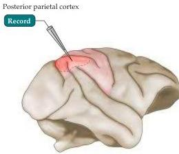
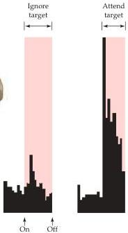
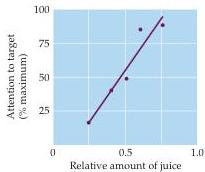
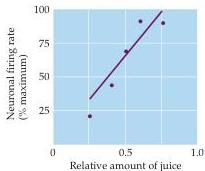

Chapter Twenty-Five

(A)

(B)

(C)

Figure 25.10 Selective activation of neurons in the parietal cortex of a rhesus monkey as a function of attention (in this case, attention is directed to a light associated with a fruit juice reward).
(A) Region of recording.
(B) Although the baseline level of activity of the neuron being studied here remains unchanged when the monkey ignores a visual target (left), firing rate increases dramatically when the monkey attends to the same stimulus (right).
The histograms indicate action potential frequency per unit time.
(C) When given a choice of where to attend, the monkey pays increasing attention to a particular visual target when more fruit juice reward can be expected for doing so (left), and the firing rate of a parietal neuron under study increases accordingly (B after Lynch et al., 1977.
C after Platt and Glimcher, 1999.)

stimuli are present in the temporal cortex of rhesus monkeys (Figure 25.11).
The behavior of these neurons in the vicinity of the superior temporal sulcus is generally consistent with one of the major functions ascribed to the human temporal cortex—namely, the recognition and identification of complex stimuli.
For example, some neurons in the inferior temporal gyrus of the rhesus monkey cortex respond specifically to the presentation of a monkey face.
These cells are often quite selective; thus, some respond only to the frontal view of a face and others only to profiles (Figure 25.11B,C).
Furthermore, the cells are not easily deceived.
When parts of faces or generally similar objects are presented, such cells typically fail to respond.

In principle, it is unlikely that such "face cells" are tuned to specific faces or objects, and no cells have so far been found that are selective for a particular face.
However, it is not hard to imagine that populations of neurons differently responsive to various features of faces or other objects could act in concert to enable the recognition of such complex sensory stimuli.
In fact, recent studies