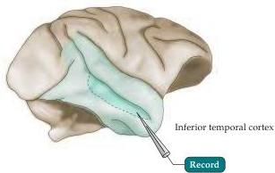
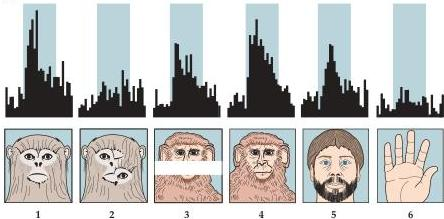
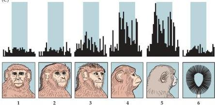

The Association Cortices

(A)

(B)

(C)

have suggested that neurons in the temporal cortex may be organized in a columnar arrangement similar to that in the primary visual cortex (see Chapter 11).
Each column is thought to represent different arrangements of complex features making up an object, while the center of neuronal activity within this map indicates the object in view.
In keeping with this general idea, optical imaging (see Box C in Chapter 11) of the surface of the temporal cortex shows that large populations of neurons are activated when monkeys view an object comprising several different geometric features.
The locus of this activity in the

Figure 25.11 Selective activation of face cells in the inferior temporal cortex of a rhesus monkey.
(A) Region of recording.
(B) The neuron being recorded from in this case responds selectively to faces seen from the front.
Scrambled parts of faces (stimulus 2) or faces with parts omitted (stimulus 3) do not elicit a maximal response.
The cell responds best to different monkey faces, as long as they are complete and viewed from the front (stimulus 4); the cell also responds to a bearded human face (stimulus 5), although not quite as robustly.
An irrelevant stimulus (a hand; stimulus 6) does not elicit a response.
(C) In this example, the neuron being recorded from responds to profiles of faces.
A face viewed from the front (stimulus 1),  $30^{\circ}$  (stimulus 2), or  $60^{\circ}$  (stimulus 3) is not as effective as a true profile (stimulus 4).
The cell responds to profiles of different monkeys (stimulus 5), but is unresponsive to an irrelevant stimulus (a brush; stimulus 6).
(After Desimone et al., 1984.)