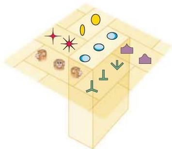
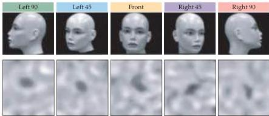
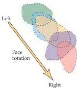

Chapter Twenty-Five

(A)

(B)

Figure 25.12 Topography of object representation.
(A) Schematic of possible columnar organization of object representations in the inferotemporal cortex.
Each cortical column is thought to signal a particular object class or point of view, with relatively smooth transitions between object features across columns.
(B) Systematic movement of the active region of inferotemporal cortex with rotation of the face.
Intrinsic signal optical images (below) were obtained for the views of five different positions of the face.
Contours circumscribing significant cortical activation by these five different views are shown on the right.
(A after Tanaka, 2001; B after Wang et al., 1996.)

upper layers of the cortex shifts systematically when object features, such as the orientation of a face, are systematically altered (Figure 25.12).
These further observations suggest that object identification relies on graded signals carried by a population of neurons rather than on the specific output of one or a few cells selective for a particular object.

# "Planning Neurons" in the Monkey Frontal Cortex

In confirmation of the human clinical evidence about the function of the frontal association cortices, neurons that appear to be specifically involved in planning have been identified in the frontal cortices of rhesus monkeys.

The behavioral test used to study cells in the monkey frontal cortex is called the delayed response task (Figure 25.13A).
Variants of this task are used to assess frontal lobe function in a variety of situations, including the