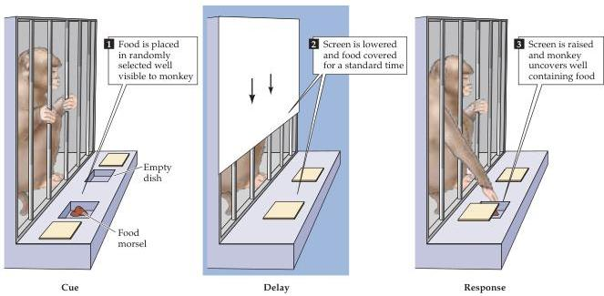
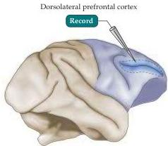
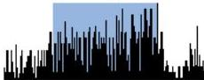
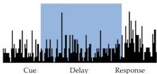

The Association Cortices

(A)

(B)

(C) Stimulus (food morsel) presented

(D) No stimulus presented
Figure 25.13 Activation of neurons near the principal sulcus of the frontal lobe during delayed response task.
(A) Illustration of task.
The experimenter randomly varies the well in which the food is placed.
The monkey watches the morsel being covered, and then the screen is lowered for a standard time.
When the screen is raised, the monkey is allowed to uncover only one well to retrieve the food.
Normal monkeys learn this task quickly, usually performing at a level of  $90\%$  correct after less than 500 training trials, whereas monkeys with frontal lesions perform poorly.
(B) Region of recording.
(C) Activity of a delay-specific neuron in the prefrontal cortex of a rhesus monkey recorded during the delayed response task shown in (A).
The histograms show the number of action potentials during the cue, delay, and response periods.
The neuron begins firing when the screen is lowered and remains active throughout the delay period.
(D) When the screen is lowered and raised but no food is presented, the same neuron is less active.
(After Goldman-Rakic, 1987.)