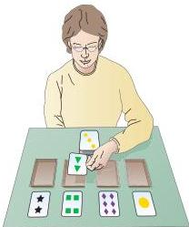
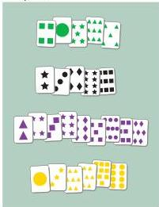
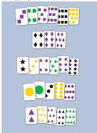
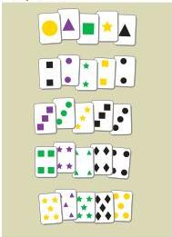

Chapter Twenty-Five

# Box C

## Neuropsychological Testing

Long before PET scanning and functional MRI were used to evaluate normal and abnormal cognitive function, several "low-tech" methods proved to be reliable means of assessing these abilities in human subjects.
From the late 1940s onward, psychologists and neurologists developed a battery of behavioral tests—generally called neuropsychological tests—to evaluate the integrity of cognitive function and to help localize lesions.

One of the most frequently used measures is the Wisconsin Card Sorting Task illustrated here.
In this test, the examiner places four cards with symbols that differ in number, shape, or color before the subject, who is given a set of response cards with similar symbols on them.
The subject is then asked to place an appropriate response card in front of the stimulus card based on a sorting rule established, but not stated, by the examiner (i.e., sort by color, number, or shape).
The examiner then indicates whether the response is "right" or "wrong." After 10 consecutive correct responses, the examiner changes the sorting rule simply by saying "wrong." The subject must then ascertain the new sorting rule and perform 10 correct trials.
The sorting rule is then changed again, until six cycles have been completed.

In 1963, the neuropsychologist Brenda Milner at the Montreal Neurological Institute showed that patients with frontal lobe lesions have consistently poor performance in the Wisconsin Card Sorting Task.
By comparing patients with known brain lesions as a result of surgery for epilepsy or tumor, Milner was able to demonstrate that this impairment is fairly specific for frontal lobe damage.
Particularly striking is the inability of frontal lobe patients to use previous information to guide subsequent behavior.
A widely accepted explanation for the sensitivity of the Wisconsin Card Sorting Task to frontal lobe deficits is the "planning" aspect of this test.
To respond correctly, the subject must retain information about the previous trial, which is then used to guide behavior on future trials.
Processing this sort of information is characteristic of frontal lobe function.

A variety of other neuropsychological tests have been devised to evaluate the functional integrity of other cognitive functions.
These include tasks in which a patient is asked to identify familiar faces in a series of pictures, and others in which "distractors" interfere with the patient's ability to attend to salient stimulus features.
An example of the latter is the Stroop Interference Test, in which patients are asked to read the names of colors presented in color-conflicting print

Sort by color

Sort by shape

Sort by number