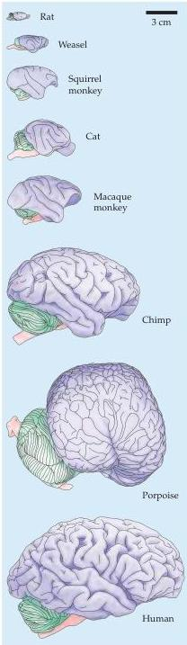

Chapter Twenty-Five

# Box D

## Brain Size and Intelligence

The fact that so much of the brain is occupied by the association cortices raises a fundamental question: does more of it provide individuals with greater cognitive ability? Humans and other animals obviously vary in their talents and predispositions for a wide range of cognitive behaviors.
Does a particular talent imply a greater amount of neural space in the service of that function?

Historically, the most popular approach to the issue of brain size and behavior in humans has been to relate the overall size of the brain to a broad index of performance, conventionally measured in humans by "intelligence tests." This way of studying the relationship between brain and behavior has caused considerable trouble.
In general terms, the idea that the size of brains from different species reflects intelligence represents a simple and apparently valid idea (see figure).
The ratio of brain weight to body weight for fish is 1:5000; for reptiles it is about 1:1500; for birds, 1:220; for most mammals, 1:180; and for humans, it is 1:50.
If intelligence is defined as the full spectrum of cognitive performance, surely no one would dispute that a human is more intelligent than a mouse, or that this difference is explained in part by the 3000-fold difference in the size of the brains of these species.
Does it follow, however, that relatively small differences in the size of the brain among related species, strains, genders, or individuals—differences that often persist even after correcting for body size—are also a valid measure of cognitive abilities? Certainly no issue in neuroscience has provoked more heated debate than the notion that alleged differences in brain size among races (or the demonstrable differences in brain size between men and women) reflect differences in performance.
The passion

attending this controversy has been generated not only by the scientific issues involved, but also by the specters of racism and misogyny.

Nineteenth-century enthusiasm for brain size as a simple measure of human performance was championed by some remarkably astute scientists (including Darwin's cousin Francis Galton and the French neurologist Paul Broca), as well as others whose motives and methods are now suspect (see Gould, 1978, 1981 for a fascinating and authoritative commentary).
Broca, one of the great neurologists of his day and a gifted observer, not only thought that brain size reflected intelligence, but was of the opinion (as was just about every other nineteenth-century male scientist) that white European males had larger and better developed brains than anyone else.
Based on what was known about the human brain in the late nineteenth century, it was perhaps reasonable for Broca to consider it, like the liver or the lung, as an organ having a largely homogeneous function.
Ironically, it was Broca himself who laid the groundwork for the modern view that the brain is a heterogeneous collection of highly interconnected but functionally discrete systems (see Chapter 26).
Nonetheless, the simplistic nineteenth-century approach to brain size and intelligence has persisted in some quarters well beyond its time.

There are at least two reasons why measures such as brain weight or cranial capacity are not easily interpretable indices of intelligence, even though small observed differences may be statistically valid.
First is the obvious difficulty of defining and accurately measuring intelligence, particularly among humans with different educational and cultural backgrounds.
Second is the functional diversity and connectional complexity of

