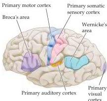

Chapter Twenty-Six

Figure 26.1 Diagram of the major brain areas involved in the comprehension and production of language.
The primary sensory, auditory, visual, and motor cortices are indicated to show the relation of Broca's and Wernicke's language areas to these other areas that are necessarily involved in the comprehension and production of speech, albeit in a less specialized way.

Although the concept of lateralization has already been introduced in describing the unequal functions of the parietal lobes in attention and of the temporal lobes in recognizing different categories of objects, it is in language that this idea has been most thoroughly documented.
Because language is so important to human beings, its lateralization has given rise to the misleading idea that one hemisphere in humans is actually "dominant" over the other—namely, the hemisphere in which the major capacity for language resides.
The true significance of lateralization for language or any other cognitive ability, however, lies in the efficient subdivision of complex functions between the hemispheres, rather than in any superiority of one hemisphere over the other.
Indeed, pop psychological dogmas about cortical redundancy notwithstanding, it is a safe presumption is that every region of the brain is doing something important.

A first step in the proper consideration of these issues is recognizing that the cortical representation of language is distinct from the circuitry concerned with the motor control of the larynx, pharynx, mouth, and tongue—the structures that produce speech sounds (Box A).
Cortical representation is also distinct from, although clearly related to, the circuits underlying the auditory perception of spoken words and the visual perception of written words in the primary auditory and visual cortices, respectively (Figure 26.1).
Whereas the neural substrates for language as such depend on these essential motor and sensory functions, the regions of the brain that are specifically devoted to language transcend these more basic elements.
The main concern of the areas of cortex that represent language is using of a system of symbols for purposes of communication—spoken and heard, written and read, or, in the case of sign language, gestured and seen.
Thus, the essential function of the cortical language areas, and indeed of language, is symbolic representation.
Obedience to a set of rules for using these symbols (called grammar), ordering them to generate useful meanings (called syntax), and giving utterances the appropriate emotional valence (called prosody), are all important and readily recognized regardless of the particular mode of representation and expression.

Given the profound biological and social importance of communication among the members of a species, it is not surprising that other animals communicate in ways that, while grossly impoverished compared to human language, nonetheless suggest the sorts of communicative skills and interactions from which human language evolved in the brains of our prehominid ancestors (Box B).

## Aphasias

The distinction between language and the related sensory and motor capacities on which it depends was first apparent in patients with damage to specific brain regions.
Clinical evidence of this sort showed that the ability to move the muscles of the larynx, pharynx, mouth, and tongue can be compromised without abolishing the ability to use spoken language to communicate (even though a motor deficit may make communication difficult).
Similarly, damage to the auditory pathways can impede the ability to hear without interfering with language functions per se (as is obvious in individuals who have become partially or wholly deaf later in life).
Damage to specific brain regions, however, can compromise essential language functions while leaving the sensory and motor infrastructure of verbal communication intact.
These syndromes, collectively referred to as aphasias, diminish or abolish the ability to comprehend and/or to produce language, while sparing