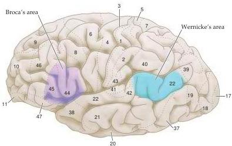

Language and Speech

Figure 26.2 The relationship of the major language areas to the classical cytoarchitectonic map of the cerebral cortex.
As discussed in Chapter 25, about 50 histologically distinct regions (cytoarchitectonic areas) have been described in the human cerebral cortex.
Whereas primary sensory and motor functions are sometimes coextensive with these areas, more general cognitive functions like attention, identification, and planning typically encompass a number of different cytoarchitectonic areas in one or more cortical lobes.
The language functions described by Broca and Wernicke are associated with at least three of the cytoarchitectonic areas defined by Brodmann (area 22, at the junction of the parietal and temporal lobes [Wernicke's area]; and areas 44 and 45, in the ventral and posterior region of the frontal lobe [Broca's area]), and are not coextensive with any of them.

the ability to perceive the relevant stimuli and to produce intelligible words.
Missing in these patients is the capacity to recognize or employ the symbolic value of words, thus depriving such individuals of the linguistic understanding, grammatical and syntactical organization, and appropriate intonation that distinguishes language from nonsense (Box C).

The localization of language function to a specific region (and to some degree a hemisphere) of the cerebrum is usually attributed to the French neurologist Paul Broca and the German neurologist Carl Wernicke, who made their seminal observations in the late 1800s.
Both Broca and Wernicke examined the brains of individuals who had become aphasic and later died.
Based on correlations of the clinical picture and the location of the brain damage, Broca suggested that language abilities were localized in the ventroposterior region of the frontal lobe (Figures 26.1 and 26.2).
More importantly, he observed that the loss of the ability to produce meaningful language—as opposed to the ability to move the mouth and produce words—was usually associated with damage to the left hemisphere.
"On parle avec l'hemisphere gauche," Broca concluded.
The preponderance of aphasic syndromes associated with damage to the left hemisphere has supported his claim that one speaks with the left hemisphere, a conclusion amply confirmed by a variety of modern studies using functional imaging (albeit with some important caveats, discussed later in the chapter).

Although Broca was basically correct, he failed to grasp the limitations of thinking about language as a unitary function localized in a single cortical region.
This issue was better appreciated by Wernicke, who distinguished between patients who had lost the ability to comprehend language and those who could no longer produce language.
Wernicke recognized that some aphasic patients do not understand language but retain the ability to produce utterances with reasonable grammatical and emotional content.
He concluded that lesions of the posterior and superior temporal lobe on the left side tend to result in a deficit of this sort.
In contrast, other patients continue to comprehend language but lack the ability to organize or control the linguistic content of their response.
Thus, they produce nonsense syllables, transposed words, and utter grammatically incomprehensible phrases.
These deficits are associated with damage to the posterior and inferior region of the left frontal lobe, an area that Broca emphasized as an important substrate for language (see Figures 26.1 and 26.2).

