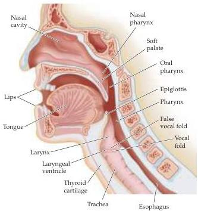

Chapter Twenty-Six

# Box A

## Speech

The organs that produce speech include the lungs, which serve as a reservoir of air; the larynx, which is the source of the periodic stimulus quality of “voiced” sounds; and the pharynx, oral, and nasal cavities and their included structures (e.g., tongue, teeth, and lips), which modify (or filter) the speech sounds that eventually emanate from the speaker.
The fundamentally correct idea that the larynx is the “source” of speech sounds and the rest of the vocal tract acts as a filter that modulates the sound energy of the source is an old one, having been proposed by Johannes Mueller in the nineteenth century.

Although the physiological details are complex, the general operation of the vocal apparatus is simple.
Air expelled from the lungs accelerates as it passes through a constricted opening between the vocal folds (“vocal cords”) called the glottis, thus decreasing the pressure in the air stream (according Bernoulli’s principle).
As a result, the vocal folds come together until the pressure buildup in the lungs forces them open again.
The ongoing repetition of this process results in an oscillation of sound wave pressure, the frequency of which is determined primarily by the muscles that control the tension on the vocal cords.
The frequencies of these oscillations—which are the basis of voiced speech sounds—range from about 100 to about 400 Hz, depending on the gender, size, and age of the speaker.

The larynx has many other consequential effects on the speech signal that create additional speech sounds.
For instance, the vocal folds can open suddenly to produce what is called a glottal stop (as in the beginning of the exclamation “Idiot!”).
Alternatively, the vocal folds can hold an intermediate position for the production of consonants such as h, or they can be completely open for “unvoiced” consonants such as s or f (i.e., speech sounds that don’t have the periodic quality derived from vocal fold oscillations).
In short, the larynx is important in the production of virtually all vocal sounds.

The vocal system can be thought of as a sort of musical instrument capable of extraordinary subtlety and exquisite modulation.
As in the sound produced by a musical instrument, however, the primary source of oscillation (e.g., the reed of a clarinet or the vocal folds in speech) is hardly the whole story.
The entire pathway between the vocal folds and the lips (and nostrils) is equally critical in determining speech sounds, as is the structure of a musical instrument.
The key determinants of the sound that emanates from an instrument are its natural resonances, which shape or filter the sound pressure oscillation.
For the vocal tract, the resonances that modulate the air stream generated by the larynx are called formants.
The resonance fre

As a consequence of these early observations, two rules about the localization of language have been taught ever since.
The first is that lesions of the left frontal lobe in a region referred to as Broca’s area affect the ability to produce language efficiently.
This deficiency is called motor or expressive