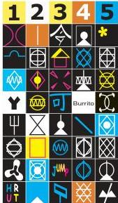

Chapter Twenty-Six

# Box B

## Do Other Animals Have Language?

Over the centuries, theologians, natural philosophers, and a good many modern neuroscientists have argued that language is uniquely human, this extraordinary behavior being seen as setting us qualitatively apart from our fellow animals.
However, the gradual accumulation of evidence during the last 75 years demonstrating highly sophisticated systems of communication in species as diverse as bees, birds, monkeys, and whales has made this point of view increasingly untenable, at least in a broad sense (see Box B in Chapter 23).
Until recently, however, human language has appeared unique in the ability to associate specific meanings with arbitrary symbols, ad infinitum.
In the dance of the honeybee described so beautifully by Karl von Frisch, for example, each symbolic movement made by a foraging bee that returns to the hive encodes only a single meaning, whose expression and appreciation has been hardwired into the nervous systems of the actor and the respondents.

A series of controversial studies in great apes, however, have indicated that the rudiments of the human symbolic communication are evident in the behavior of our closest relatives.
Although early efforts were sometimes patently misguided (initial attempts to teach chimpanzees to speak were without merit simply because these animals lack the necessary vocal apparatus), modern work on this issue has shown that if chimpanzees are given the means to communicate symbolically, they demonstrate some surprising talents.
While techniques have varied, most psychologists who study chimps have used some form of manipulable symbols that can be arranged to express ideas in an interpretable manner.

For example, chimps can be trained to manipulate tiles or other symbols (such as the gestures of sign language) to represent words and syntactical constructs, allowing them to communicate simple demands, questions, and even spontaneous expressions.
The most remarkable results have come from increasingly sophisticated work with chimps using keyboards with a variety of symbols (Figure A).
With appropriate training, chimps can choose from as many as 400 different symbols to construct expressions, allowing the researchers to have something resembling a rudimentary conversation with their charges.
The more accomplished of these animals are alleged to have "vocabularies" of several thousand words or phrases, equivalent to a child 3 or 4 years of age (how they use these words compared to a child, however, is much less impressive).

Given the challenge this work presents to some long-held beliefs about the uniqueness of human language, it is not surprising that these claims continue to stir up debate and are not universally accepted.
Nonetheless, the issues raised certainly deserve careful consideration by anyone interested in human language abilities and how our remarkable symbolic skills may have evolved from the communicative capabilities of our ancestors.
The pressure for the evolution of some form of symbolic communication in great apes seems clear enough.
Ethologists studying chimpanzees in the wild have described extensive social communication based on gestures, the manipulation of objects, and facial expressions.
This intricate social intercourse is likely to be the antecedent of human language; one need only think of the importance of gestures and facial expressions as ancillary aspects of our own speech to appreciate this point.
(The sign language studies described later in the chapter are also pertinent here.)

Whether the regions of the temporal, parietal, and frontal cortices that support human language also serve these symbols

(A)
Symbols
Meanings

|  1 | 2 | 3 | 4 | 5  |
| --- | --- | --- | --- | --- |
|  Car | Raisin | Ham-burger | Sherman | Egg  |
|  Sue's office | Groom | Log cabin | Chow | Stick  |
|  Outdoors | Rose | Fire | TV | Rock  |
|  Yes | Milk | Hotdog | Burrito | Criss-cross  |
|  Orange | No | Can opener | Pine needle | Ice  |
|  Bread | Hug | Water | Straw | Hide  |
|  Hose | Get | Jump | Turtle | Goodbye  |
|  Hurt | Look | Tree house | Come | Midway  |

Section of keyboard showing lexical symbols used to study symbolic communication in great apes.
(From Savage-Rumbaugh et al., 1998.)