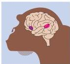

Language and Speech 643

(B)

The brains of great apes are remarkably similar to those of humans, including regions that, in humans, support language.
The areas comparable to Broca's area and Wernicke's area are indicated.

bolic functions in the brains of great apes (Figure B) is an important question that remains to be tackled.
In addition, field studies of vervets and other monkey species have shown that the alarm calls of these animals differ according to the nature of the threat.
Thus, ethologists Dorothy Cheney and Robert Seyfarth found that a specific alarm call uttered when a vervet monkey spotted a leopard caused nearby vervets to take to the trees; in contrast, the alarm call given when a monkey saw an eagle caused other monkeys to look skyward.
More recent studies of monkey calls by Marc

Hauser and his collaborators have greatly extended this sort of work.

Although much uncertainty remains, in light of this evidence only someone given to extraordinary anthropocentrism would continue to argue that symbolic communication is a uniquely human attribute.
In the end, it may turn out to be that human language, for all its seeming complexity, is based on the same general scheme of inherent and acquired neural associations that appears to be the basis of any animal communication.

# References

CERUTTI, D.
AND D.
RUMBAUGH (1993) Stimulus relations in comparative primate perspective.
Psychological Record 43: 811-821.
GHAZANFAR, A.
A.
AND M.
D.
HAUSER (2001) The auditory behavior of primates: a neuroethological perspective.
Curr.
Opin.
Biol.
16: 712-720.
GOODALL, J.
(1990) Through a Window: My Thirty Years with the Chimpanzees of Gombe.
Boston: Houghton Mifflin Company.
GRIFFIN, D.
R.
(1992) Animal Minds.
Chicago: The University of Chicago Press.
HALSER, M.
D.
(1996) The Evolution of Communication.
Cambridge, MA: Bradford/MIT Press.
HELTNE, P.
G.
AND L.
A.
MARQUARDT (EDS.) (1989) Understanding Chimpanzees.
Cambridge, MA: Harvard University Press.

MILES, H.
L.
W.
AND S.
E.
HARPER (1994) "Ape language" studies and the study of human language origins.
In *Hominid Culture in Primate Perspective*, D.
Quiatt and J.
Itani (eds.).
Niwot, CO: University Press of Colorado, pp.
253-278.
SAVAGE-RUMBAUGH, S., J.
MURPHY, R.
A.
SEV-CIK, K.
E.
BRAKKE, S.
L.
WILLIAMS AND D.
M.
RUMBAUGH (1993) Language Comprehension in Ape and Child.
Monographs of the Society for Research in Child Development, Serial No.
233, Vol.
58, Nos.
3, 4.
SAVAGE-RUMBAUGH, S., S.
G.
SHANKER, AND T.
J.
TAYLOR (1998) Apes, Language, and the Human Mind.
New York: Oxford University Press.
SEFARTH, R., M.
AND D., I.
CHENEY (1984) The natural vocalizations of non-human primates.
Trends Neurosci.
7: 66-73.
TERRACE, H.
S.
(1983) Apes who "talk": Language or projection of language by their teachers? In Language in Primates: Perspectives and Implications, J.
de Luce and H.
T.
Wilder (eds.).
New York: Springer-Verlag, pp.
19-42.
WHITEN, A., J.
GOODALL, W.
C.
McGREW, T.
NISHIDA, V.
REYNOLDS, Y.
SUGIYAMA, C.
E.
G.
TUTIN, R.
W.
WRANGHAM AND C.
BOESCH (1999) Cultures in chimpanzees.
Nature 399: 682-685.
VON FRISCH, K.
(1993) The Dance Language and Orientation of Bees (Transl.
by Leigh E.
Chadwick).
Cambridge, MA: Harvard University Press.
WALLMAN, J.
(1992) Aping Language.
New York: Cambridge University Press.

the posterior frontal lobe and its proximity to the primary motor cortex already discussed (see Chapters 15 and 25).

The second rule is that damage to the left temporal lobe causes difficulty understanding spoken language, a deficiency referred to as sensory or receptive aphasia, also known as Wernicke's aphasia.
(Deficits of reading and writing—alexias and agraphias—are separate disorders that can arise from damage to related but different brain areas; most aphasics, however, also have difficulty with these closely linked abilities as well.) Receptive aphasia generally reflects damage to the auditory association cortices in the posterior temporal lobe, a region referred to as Wernicke's area.

A final broad category of language deficiency syndromes is conduction aphasia.
These disorders arise from lesions to the pathways connecting the relevant temporal and frontal regions, such as the arcuate fasciculus in the subcortical white matter that links Broca's and Wernicke's areas.
Interruption of this pathway may result in an inability to produce appropriate responses to heard communication, even though the communication is understood.

In a classic Broca's aphasia, the patient cannot express himself appropriately because the organizational aspects of language (its grammar and syn