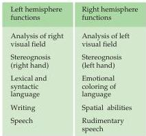
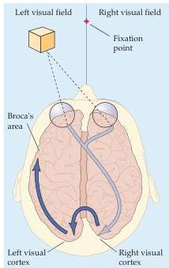
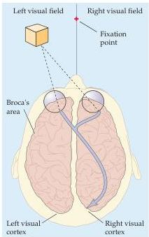
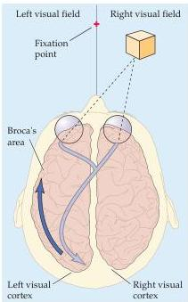

Language and Speech

To evaluate the functional capacity of each hemisphere in split-brain patients, it is essential to provide information to one side of the brain only.
Sperry, Michael Gazzaniga (a key collaborator in this work), and others devised several simple ways to do this, the most straightforward of which was to ask the subject to use each hand independently to identify objects without any visual assistance (Figure 26.3A).
Recall from Chapter 8 that somatic sensory information from the right hand is processed by the left hemisphere, and vice versa.
By asking the subject to describe an item being manipulated by one hand or the other, the language capacity of the relevant hemisphere could be examined.
Such testing showed clearly that the two hemispheres differ in their language ability (as expected from the postmortem correlations described earlier).

(A)

(C)

(B)
Normal individual

Split-brain individual

Split-brain individual