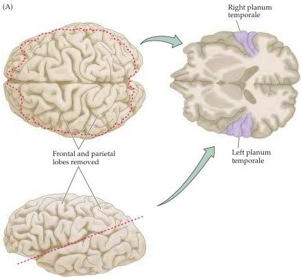
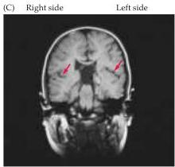

Language and Speech

Figure 26.4 Asymmetry of the right and left human temporal lobes.
(A) The superior portion of the brain has been removed as indicated to reveal the dorsal surface of the temporal lobes in the right-hand diagram (which presents a dorsal view of the horizontal plane).
A region of the surface of the temporal lobe called the planum temporale is significantly larger in the left hemisphere of most (but far from all) individuals.
(B) Measurements of the planum temporale in adult and infant brains.
The mean size of the planum temporale is expressed in arbitrary planimetric units to get around the difficulty of measuring the curvature of the gyri within the planum.
The asymmetry is evident at birth and persists in adults at roughly the same magnitude (on average, the left planum is about  $50\%$  larger than the right).
(C) A magnetic resonance image in the frontal plane, showing this asymmetry (arrows) in a normal adult subject.

hemisphere is evident in  $97\%$  of the population, argues that this association has some other cause.
The structural correlate of the functional left-right differences in hemispheric language abilities, if indeed there is one at a gross anatomical level, is simply not clear, as is the case for the lateralized hemispheric functions described in Chapter 25.

# Mapping Language Functions

The pioneering work of Broca and Wernicke, and later Geschwind and Sperry, clearly established differences in hemispheric function.
Several techniques have since been developed that allow hemispheric attributes to be assessed in neurological patients with an intact corpus callosum, and in normal subjects.

One method that has long been used for the clinical assessment of language lateralization was devised in the 1960s by Juhn Wada at the Montreal Neurological Institute.
In the so-called Wada test, a short-acting anesthetic (e.g., sodium amytal) is injected into the left carotid artery; this procedure transiently "anesthetizes" the left hemisphere and thus tests the functional capabilities of the affected half of the brain.
If the left hemisphere is indeed "dominant" for language, then the patient becomes transiently aphasic while carrying out an ongoing verbal task like counting.
The anesthetic is rapidly diluted by the circulation, but not before its local effects on the hemisphere on the side of the injection can be observed.
Since this test is potentially dangerous, its use is limited to neurological and neurosurgical patients.

(B)

|  Planum temporale measurements of 100 adult and 100 infant brains  |   |   |
| --- | --- | --- |
|   | Left hemisphere | Right hemisphere  |
|  Infant | 20.7 | 11.7  |
|  Adult | 37.0 | 18.4  |

