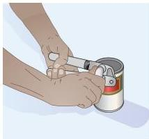
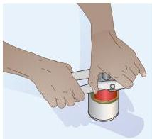
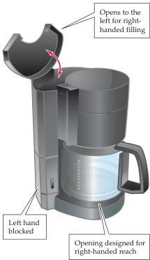

Chapter Twenty-Six

# Box D

## Language and Handedness

Approximately 9 out of 10 people are right-handed, a proportion that appears to have been stable over thousands of years and across all cultures in which handedness has been examined.
Handedness is usually assessed by having individuals answer a series of questions about preferred manual behaviors, such as "Which hand do you use to write?"; "Which hand do you use to throw a ball?"; or "Which hand do you use to brush your teeth?" Each answer is given a value, depending on the preference indicated, providing a quantitative measure of the inclination toward right- or left-handedness.
Anthropologists have determined the incidence of handedness in ancient cultures by examining artifacts; the shape of a flint ax, for example, can indicate whether it was made by a right- or left-handed individual.
Handedness in antiquity has also been assessed by examining the incidence of figures in artistic representations who are using one hand or the other.
Based on this evidence, the human species appears always to have been a right-handed one.
Handedness, or its equivalent, is not peculiar to humans; many studies have demonstrated paw preference in animals ranging from mice to monkeys that is, at least in some ways, similar to human handedness.

Whether an individual is right- or left-handed has a number of interesting consequences.
As will be obvious to left-handers, the world of human artifacts is in many respects a right-handed one (Figure A).
Implements such as scissors, knives, coffee pots, and power tools are constructed for the right-handed majority.
Books and magazines are also designed for right-handers (compare turning this page with your left and right hands), as are golf clubs and guitars.
By the same token, the challenge of pen-

manship is different for left- and right-handers by virtue of writing from left to right (Figure B).
Perhaps as a consequence of such biases, the accident rate for left-handers in all categories (work, home, sports) is higher than for right-handers, including the rate of traffic fatalities.
However, there are also some advantages to being left-handed.
For example, an inordinate number of international fencing champions have been left-handed.
The reason for this fact is simply that the majority of any individ

ual's opponents will be right-handed; therefore, the average fencer, whether right- or left-handed, is less practiced at parrying thrusts from left-handers.

Hotly debated in recent years have been the related questions of whether being left-handed is in any sense "pathological," and whether being left-handed entails a diminished life expectancy.
No one disputes the fact that there is currently a surprisingly small number of left-handers among the elderly (Figure C).
These data have come from studies of the

(A)
Right-handed

Left-handed

Examples of common objects designed for use by the right-handed majority.