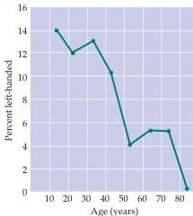

Language and Speech 651

(B)
Right-handed writing
Writing techniques for right- and left-handed individuals.

Left-handed writing

(C)

general population and have been supported by information gleaned from The Baseball Encyclopedia (in which longevity and other characteristics of a large number of healthy left- and right-handers have been recorded because of interest in the U.S.
national pastime).

Two explanations of this peculiar finding have been put forward.
Stanley Coren and his collaborators at the University of British Columbia have argued that these statistics reflect a higher mortality rate among left-handers partly as a result of increased accidents, but also because of other data that show left-handedness to be associated with a variety of pathologies (there is, for instance, a higher incidence of left-handedness among individuals classified as mentally retarded).
Coren and others have suggested that left-handedness may arise because of developmental problems in the pre- and/or perinatal period.
If true, then a rationale for decreased longevity would have been identified that might combine with greater proclivity to accidents in a right-hander's world.

An alternative explanation, however, is that the diminished number of left-handers among the elderly is primarily a reflection of sociological factors—namely,

a greater acceptance of left-handed children today compared to the first half of the twentieth century.
In this view, there are fewer older left-handers now because in earlier generations parents, teachers, and other authority figures encouraged (and sometimes insisted on) right-handedness.
The weight of the evidence favors the sociological explanation.

The relationship between handedness and other lateralized functions—language in particular—has long been a source of confusion.
It is unlikely that there is any direct relationship between language and handedness, despite much speculation to the contrary.
The most straightforward evidence on this point comes from the results of the Wada test described in the text.
The large number of such tests carried out for clinical purposes indicate that about 97% of humans, including the majority of left-handers, have their major language functions in the left hemisphere (although it should be noted that right hemispheric dominance for language is much more common among left-handers).
Since most left-handers have language function on the side of the brain opposite the control of their preferred hand, it is hard to argue for any strict

The percentage of left-handers in the normal population as a function of age (based on more than 5000 individuals).
Taken at face value, these data indicate that right-handers live longer than left-handers.
Another possibility, however, is that the paucity of elderly left-handers at present may simply reflect changes over the decades in the social pressures on children to become right-handed.
(From Coren, 1992.)

relationship between these two lateralized functions.
In all likelihood, handedness, like language, is first and foremost an example of the advantage of having any specialized function on one side of the brain or the other to make maximum use of the available neural circuitry in a brain of limited size.

# References

BAKAN, P.
(1975) Are left-handers brain damaged? New Scientist 67: 200-202.
COREN, S.
(1992) The Left-Hander Syndrome: The Causes and Consequence of Left-Handedness.
New York: The Free Press.
DAVIDSON, R.
J.
AND K.
HUGDAHL (EDS.) (1995) Brain Asymmetry.
Cambridge, MA: MIT Press.
SALIVE, M.
E., J.
M.
GURALNIK AND R.
J.
GLYNN (1993) Left-handedness and mortality.
Am.
J.
Pub.
Health 83: 265-267.