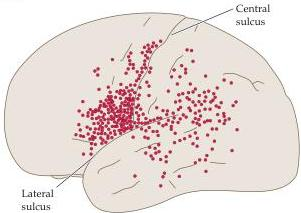
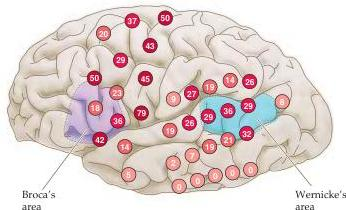

Chapter Twenty-Six

Figure 26.5 Evidence for the variability of language representation among individuals, determined by electrical stimulation during neurosurgery.
(A) Diagram from Penfield's original study illustrating sites in the left hemisphere at which electrical stimulation interfered with speech.
(B) Diagrams summarizing data from 117 patients whose language areas were mapped by electrical recording at the time of surgery.
The number in each red circle indicates the (quite variable) percentage of patients who showed interference with language in response to stimulation at that site.
Note also that many of the sites that elicited interference fall outside the classic language areas (Broca's area, shown in purple; Wernicke's area, shown in blue).
(A after Penfield and Roberts, 1959; B after Ojemann et al., 1989.)

Less invasive (but less definitive) ways to test the cognitive abilities of the two hemispheres in normal subjects include positron emission tomography, functional magnetic resonance imaging (see Box C in Chapter 1), and the sort of tachistoscopic presentation used so effectively by Sperry and his colleagues (even when the hemispheres are normally connected, subjects show delayed verbal responses and other differences when the right hemisphere receives the instruction).
Application of these various techniques, together with noninvasive brain imaging, has amply confirmed the hemispheric lateralization of language functions.
More importantly, such studies have provided valuable diagnostic tools to determine, in preparation for neurosurgery, which hemisphere is "eloquent": although most individuals have the major language functions in the left hemisphere, a few—about 3% of the population—do not (the latter are much more often left-handed; see Box D).

Once the appropriate hemisphere is known by these means, neurosurgeons typically map language functions more precisely by electrical stimulation of the cortex during the surgery to further refine their approach to the problem at hand.
By the 1930s, the neurosurgeon Wilder Penfield and his colleagues at the Montreal Neurological Institute had already carried out a detailed localization of cortical capacities in a large number of patients (see Chapter 8).
Penfield used electrical mapping techniques adapted from neurophysiological work in animals to delineate the language areas of the cortex prior to removing brain tissue in the treatment of tumors or epilepsy.
Such intraoperative mapping guaranteed that the cure would not be worse than the disease and has been widely used ever since, with increasingly sophisticated stimulation and recording methods.
As a result, a wealth of more detailed information about language localization has emerged.

Penfield's observations, together with more recent studies performed by George Ojemann and his group at the University of Washington, have further advanced the conclusions inferred from postmortem correlations and other approaches.
As expected, intraoperative studies using electrophysiological recording methods have shown that a large region of the perisylvian cortex of the left hemisphere is clearly involved in language production and comprehension (Figure 26.5).
A surprise, however, has been the variability in language localization from patient to patient.
Ojemann found that the brain regions involved in language are only approximately those indicated by older textbook treatments, and that their exact locations differ unpredictably among individuals.
Equally unexpected, bilingual patients do not necessar

(A)

(B)