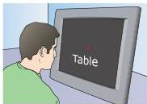
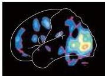
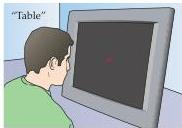
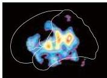
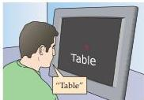
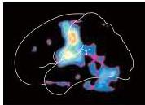
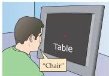
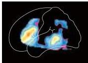

Language and Speech

ily use the same bit of cortex for storing the names of the same objects in two different languages.
Moreover, although single neurons in the temporal cortex in and around Wernicke's area respond preferentially to spoken words, they do not show preferences for a particular word.
Rather, a wide range of words can elicit a response in any given neuron.

Despite these advances, neurosurgical studies are complicated by their intrinsic difficulty and to some extent by the fact that the brains of the patients in whom they are carried out are not normal.
The advent of positron emission tomography in the 1980s, and more recently functional magnetic resonance imaging, has allowed the investigation of the language regions in normal subjects by noninvasive brain imaging (Figure 26.6).
Recall that these

Passively viewing words

Listening to words

Speaking words

Figure 26.6 Language-related regions of the left hemisphere mapped by positron emission tomography (PET) in a normal human subject.
Subjects reclined within the PET scanner and followed instructions on a special display (these details are not illustrated).
The left panels indicate the task being practiced prior to scanning.
The PET scan images are shown on the right.
Language tasks such as listening to words and generating word associations elicit activity in Broca's and Wernicke's areas, as expected.
However, there is also activity in primary and association sensory and motor areas for both active and passive language tasks.
These observations indicate that language processing involves cortical regions in addition to the classic language areas.
(From Posner and Raichle, 1994.)

