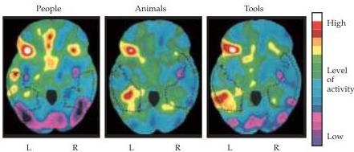

Chapter Twenty-Six

Figure 26.7 Different regions in the temporal lobe are activated by different word categories using PET imaging.
Dotted lines show location of the relevant temporal regions in these horizontal views.
Note the different patterns of activity in the temporal lobe in response to each stimulus category.
(After Damasio et al., 1996.)

techniques reveal the areas of the brain that are active during a particular task because the related electrical activity increases local metabolic activity and therefore local blood flow (see Boxes B and C in Chapter 1).
Much like Ojemann's studies in neurosurgical patients, the results of this approach, particularly in the hands of Marc Raichle, Steve Petersen, and their colleagues at Washington University in St.
Louis, have challenged excessively rigid views of the localization and lateralization of linguistic function.
Although high levels of activity occur in the expected regions, large areas of both hemispheres are activated in word recognition or production tasks.

Finally, Hanna Damasio and her colleagues at the University of Iowa have shown that distinct regions of the temporal cortex are activated by tasks in which subjects named particular people, animals, or tools (Figure 26.7).
This arrangement helps explain the clinical finding that when a relatively limited region of the temporal lobe is damaged (usually by a stroke on the left side), language deficits are sometimes restricted to a particular category of objects.
These studies are also consistent with Ojemann's electrophysiological studies, indicating that language is apparently organized according to categories of meaning rather than individual words.
Taken together, such studies are rapidly augmenting the information available about how language is represented in the brain.

# The Role of the Right Hemisphere in Language

Because exactly the same cytoarchitectonic areas exist in the cortex of both hemispheres, a puzzling issue remains.
What do the comparable areas in the right hemisphere actually do? In fact, language deficits often do occur following damage to the right hemisphere.
The most obvious effect of such lesions is an absence of the normal emotional and tonal components of language—called prosodic elements—that impart additional meaning to verbal communication.
This "coloring" of speech is critical to the message conveyed, and in some languages (e.g., Mandarin Chinese) is even used to change the literal meaning of the word uttered.
These deficiencies, referred to as aprosodias, are associated with right-hemisphere damage to the cortical regions that correspond to Broca's and Wernicke's areas and associated regions in the left hemisphere.
The aprosodias emphasize that although the left hemisphere (or, better put, distinct cortical regions within that hemisphere) figures prominently in the comprehension and production of language for most humans, other regions, including areas in the right hemisphere, are needed to generate the full richness of everyday speech.