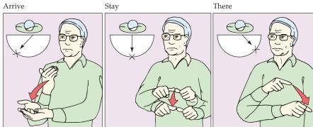
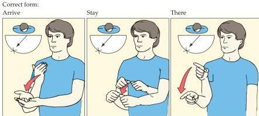

Language and Speech

In summary, whereas the classically defined regions of the left hemisphere operate more or less as advertised, a variety of more recent studies have shown that other left- and right-hemisphere areas clearly make a significant contribution to generation and comprehension of language.

# Sign Language

The implication of at least some aspects of the foregoing account is that the cortical organization of language does not simply reflect specializations for hearing and speaking; the language regions of the brain appear to be more broadly organized for processing symbols pertinent to social communication.
Strong support for this conclusion has come from studies of sign language in individuals deaf from birth.

American Sign Language has all the components (e.g., grammar, syntax, and emotional tone) of spoken and heard language.
Based on this knowledge, Ursula Bellugi and her colleagues at the Salk Institute examined the cortical localization of sign language abilities in patients who had suffered lesions of either the left or right hemisphere.
All these deaf individuals never learned language, had been signing throughout their lives, had deaf spouses, were members of the deaf community, and were right-handed.
The patients with left-hemisphere lesions, which in each case involved the language areas of the frontal and/or temporal lobes, had measurable deficits in sign production and comprehension when compared to normal signers of similar age (Figure 26.8).
In contrast, the patients with lesions in approxi

Patient with signing deficit:

Correct form:
Figure 26.8 Signing deficits in congenitally deaf individuals who had learned sign language from birth and later suffered lesions of the language areas in the left hemisphere.
Left hemisphere damage produced signing problems in these patients analogous to the aphasias seen after comparable lesions in hearing, speaking patients.
In this example, the patient (upper panels) is expressing the sentence "We arrived in Jerusalem and stayed there." Compared to a normal control (lower panels), he cannot properly control the spatial orientation of the signs.
The direction of the correct signs and the aberrant direction of the "aphasic" signs are indicated in the upper left-hand corner of each panel.
(After Bellugi et al., 1989.)