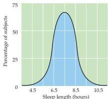
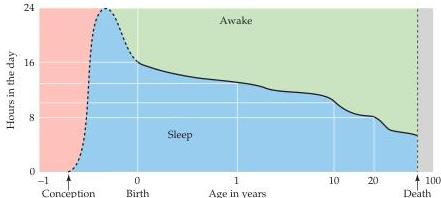
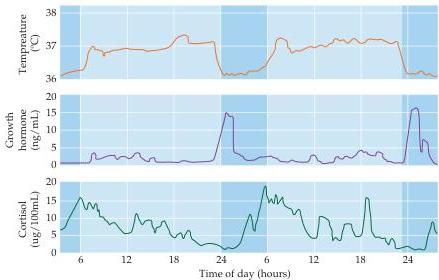

Chapter Twenty-Seven

(A)
Figure 27.1 The duration of sleep.
(A) The duration of sleep each night in adults is normally distributed with a mean of 7.5 hours and a standard deviation of about 1.25 hours.
Thus, each night about two-thirds of the population sleeps between 6.25 and 8.75 hours.
(B) The duration of daily sleep as a function of age.
(After Hobson, 1989.)

(B)

called sleep "nature's soft nurse," emphasizing (as have many others) the restorative nature of sleep.
From a perspective of energy conservation, one function of sleep is to replenish brain glycogen levels, which fall during the waking hours.
In addition, since it is generally colder at night, more energy would have to be expended to keep warm were we nocturnally active.
Body temperature has a 24-hour cycle (as do many other indices of activity and stress), reaching a minimum at night and thus reducing heat loss (Figure 27.2).
As might be expected, metabolism measured by oxygen consumption decreases during sleep.
Another plausible reason is that humans and many other animals that sleep at night are highly dependent on visual information to find food and avoid predators.

Whatever the reasons for sleeping, in mammals sleep is evidently necessary for survival.
Sleep-deprived rats lose weight despite increasing food intake and progressively fail to regulate body temperature as their core temperature increases several degrees.
They also develop infections, suggesting some compromise of the immune system.
Rats completely deprived of sleep

Figure 27.2 Circadian rhythmicity of core body temperature, and of growth hormone and cortisol levels in the blood.
In the early evening, core temperature begins to decrease whereas growth hormone begins to increase.
The level of cortisol, which reflects stress, begins to increase in the morning and stays elevated for several hours.