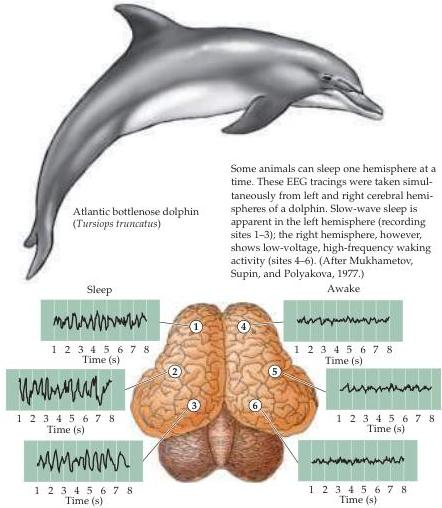

Sleep and Wakefulness 661

# Box A

## Styles of Sleep in Different Species

A wide variety of animals have a rest-activity cycle that often (but not always) occurs in a daily (circadian) rhythm.
Even among mammals, however, the organization of sleep depends very much on the species in question.
As a general rule, predatory animals can indulge, as humans do, in long, uninterrupted periods of sleep that can be nocturnal or diurnal, depending on the time of day when the animal acquires food, mates, cares for its young, and deals with life's other necessities.
The survival of animals that are preyed upon, however, depends much more critically on continued vigilance.
Such species—as diverse as rabbits and giraffes—sleep during short intervals that usually last no more than a few minutes.
Shrews, the smallest mammals, hardly sleep at all.

An especially remarkable solution to the problem of maintaining vigilance during sleep is shown by dolphins and seals, in whom sleep alternates between the two cerebral hemispheres (see figure).
Thus, one hemisphere can exhibit the electroencephalographic signs of wakefulness, while the other shows the characteristics of sleep (see Box C and Figure 27.5).
In short, although periods of rest are evidently essential to the proper functioning of the brain, and more generally to normal homeostasis, the manner in which rest is obtained depends on the particular needs of each species.

## References

ALLISON, T.
AND D.
V.
CICCHETTI (1976) Sleep in mammals: Ecological and constitutional correlates.
Science 194: 732-734.

ALLISON, T.
H.
AND H.
VAN TWYVER (1970) The evolution of sleep.
Natural History 79: 56-65.

ALLISON, T., H.
VAN TWYVER AND W.
R.
GOFF (1972) Electrophysiological studies of the echidna, Tachyglossus aculeatus.
Arch.
Ital.
Biol.
110: 145-184.

die within a few weeks (Figure 27.3A,B).
In humans, lack of sleep leads to impaired memory and reduced cognitive abilities and, if the deprivation persists, mood swings and often hallucinations.
Patients with the genetic disease fatal familial insomnia—as the name implies—die within several years of onset.
This disease, which appears in middle age, is characterized by hallucinations, seizures, loss of motor control, and the inability to enter a state of deep sleep (see the section "Stages of Sleep").