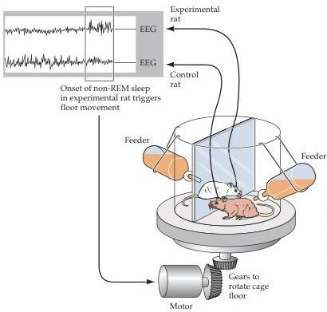
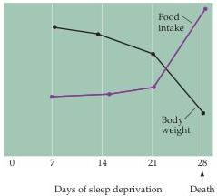

Chapter Twenty-Seven

(A) Experimental setup

(B) Experimental animals
Figure 27.3 The consequences of total sleep deprivation in rats.
(A) In this apparatus, an experimental rat is kept awake because the onset of sleep (detected electroencephalographically) triggers movement of the cage floor.
The control rat (brown) can thus sleep intermittently, whereas the experimental animal (white) cannot.
(B) After two to three weeks of sleep deprivation, the experimental animals begin to lose weight, fail to control their body temperature, and eventually die.
(After Bergmann et al., 1989.)

The longest documented period of voluntary sleeplessness in humans is 453 hours, 40 minutes (approximately 19 days)—a record achieved without any pharmacological stimulation.
The young man involved recovered after a few days, during which he slept more than normal, but otherwise seemed none the worse for wear.

# The Circadian Cycle of Sleep and Wakefulness

Human sleep occurs with circadian (circa = about; dia = day) periodicity, and biologists interested in circadian rhythms have explored a number of questions about this daily cycle.
What happens, for example, when individuals are prevented from sensing the cues they normally use to distinguish night and day? This question has been addressed by placing volunteers in an environment such as a cave or bunker that lacks external time cues (Figure 27.4).
In a typical experiment of this sort, subjects undergo a 5- to 8-day period that included social interactions, meals at normal times, and temporal cues (radio, TV).
During this acclimation period, the subjects arose and went to sleep at the usual times and maintained a 24-hour sleep-wake cycle.
After removing these normal cues, however, the subjects awakened later each day, and the cycle of sleep and wakefulness gradually lengthened to about 26 hours.
When the volunteers returned to a normal environment, the 24-hour cycle was rapidly restored.
Thus, humans (and many other animals; see Box B) have an internal "clock" that operates even in the absence of external information about the time of day; under these conditions, the clock is said to be "free-running."