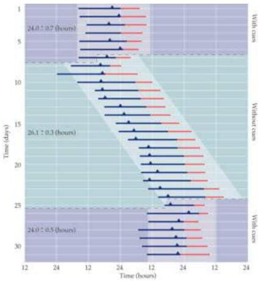

Sleep and Wakefulness 663

Figure 27.4 Rhythm of waking (blue lines) and sleeping (red lines) of a volunteer in an isolation chamber with and without cues about the day-night cycle.
Numbers represent the mean ± standard deviation of a complete wake-sleep cycle in each condition.
Triangles represent times when the rectal temperature was maximum.
(After Aschoff, 1965, as reproduced in Schmidt et.
al., 1983)

Presumably, circadian clocks evolved to maintain appropriate periods of sleep and wakefulness and to control other daily rhythms in spite of the variable amount of daylight and darkness in different seasons and at different places on the planet.
To synchronize physiological processes with the day-night cycle (called photoentrainment), the biological clock must detect decreases in light levels as night approaches.
The receptors that sense these light changes are, not surprisingly, in the outer nuclear layer of the retina, as demonstrated by the fact that removing or covering the eyes abolishes photoentrainment.
The detectors are not, however, the rods or cones (Figure 27.5A).
Rather, these cells lie within the ganglion cell layer of the primate and murine retinas.
Unlike rods and cones that are hyperpolarized when activated by light (see Chapter 11), this special class of ganglion cells contains a novel photopigment called melanopsin and are depolarized by light.
The function of these unusual photoreceptors is evidently to encode environmental illumination and to set the biological clock.
This regulation is achieved via axons running the retinohypothalmic tract (Figure 27.5B), which projects to the suprachiasmatic nucleus (SCN) of the anterior hypothalamus, the site of the circadian control of homeostatic functions.

Activation of the SCN evokes responses in neurons whose axons first synapse in the paraventricular nucleus of the hypothalamus and descend to the preganglionic sympathetic neurons in intermediolateral zone in the lateral horns of the thoracic spinal cord.
As described in Chapter 20, these pregan