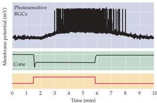
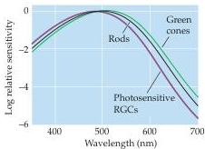
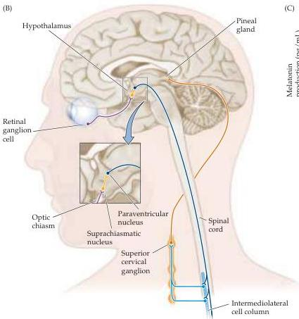
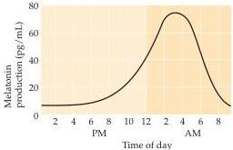

Chapter Twenty-Seven

(A)

(B)
Figure 27.5 Photoreceptors responsible for signaling circadian light changes.
(A) Functional and structural properties of photosensitive retinal ganglion cells in the rat.
Increasing the light intensity produces a burst of action potentials in these cells.
The spectral sensitivity of these cells compared to rods and one of the standard cone types is also shown.
(B) Schematic summary of targets influenced by these photosensitive retinal ganglion cells.
Projections to the SCN form the retinohypothalamic tract.
(C) The 24-hour cycle of melatonin production.

(C)
sylvius

glionic neurons modulate neurons in the superior cervical ganglia whose postganglionic axons project to the pineal gland (pineal means "pineconeshaped") in the midline near the dorsal thalamus (Figure 27.5B).
The pineal gland synthesizes the sleep-promoting neurohormone melatonin ( $N$ -acetyl-5-methoxytryptamine) from tryptophan, and secretes melatonin into the bloodstream where it modulates the brainstem circuits that ultimately gov-