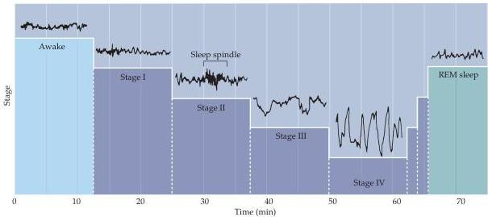

Sleep and Wakefulness 665

ern the sleep-wake cycle.
Melatonin synthesis increases as the light in the environment decreases and reaches a maximum between 2 A.M.
and 4:00 A.M.
(Figure 27.5C).
In the elderly, the pineal gland produces less melatonin, perhaps explaining why older people sleep less at night and are more often afflicted with insomnia.
Melatonin has been used to promote sleep in elderly insomniacs and to reduce disruption of the biological clocks that occurs with jet lag, but whether these therapies are really effective remains unclear.

Most sleep researchers consider the superior chiasmatic nucleus to be the "master clock." Evidence for this conclusion is that its removal of the SCN in experimental animals abolishes their circadian rhythm of sleep and waking.
Furthermore, when SCN cells are placed in organ culture, they exhibit characteristic circadian rhythms (Box B).
The SCN also governs other functions that are synchronized with the sleep-wake cycle, including body temperature, hormone secretion (e.g., cortisol), blood pressure, and urine production (see Figure 27.2).
In adults, urine production is reduced at night because of the circadian regulation of antidiuretic hormone (ADH or vasopressin) production.
Some children and elderly individuals lack this circadian control (albeit for different reasons), as evidenced by bed-wetting.

## Stages of Sleep

The normal cycle of human sleep and wakefulness implies that, at specific times, various neural systems are being activated while others are being turned off.
For centuries—indeed up until the 1950s—most people who thought about sleep considered it a unitary phenomenon whose physiology was essentially passive and whose purpose was simply restorative.
In 1953, however, Nathaniel Kleitman and Eugene Aserinksy showed, by means of electroencephalographic (EEG) recordings from normal subjects, that sleep actually comprises different stages that occur in a characteristic sequence.

Over the first hour after retiring, humans descend into successive stages of sleep (Figure 27.6).
These characteristic stages are defined primarily by electroencephalographic (EEG) criteria (Box C).
Initially, during "drowsiness"

Figure 27.6 EEG recordings during the first hour of sleep.
The waking state with the eyes open is characterized by high-frequency (15–60 Hz), low-amplitude activity (∼30 μV) activity.
This pattern is called beta activity.
Descent into stage I non-REM sleep is characterized by decreasing EEG frequency (4–8 Hz) and increasing amplitude (50–100 μV), called theta waves.
Descent into stage II non-REM sleep is characterized by 10–12 Hz oscillations (50–150 μV) called spindles, which occur periodically and last for a few seconds.
Stage III non-REM sleep is characterized by slower waves at 2–4 Hz (100–150 μV).
Stage IV sleep is defined by slow waves (also called delta waves) at 0.5–2 Hz (100–200 μV).
After reaching this level of deep sleep, the sequence reverses and a period of rapid eye movement sleep, or REM sleep, ensues.
REM sleep is characterized by low-voltage, high-frequency activity similar to the EEG activity of individuals who are awake.
(Adapted from Hobson, 1989.)