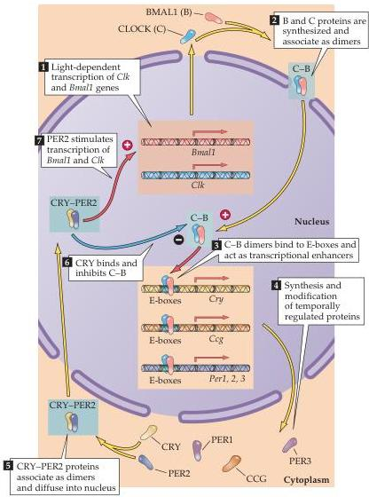

Chapter Twenty-Seven

# Box B

## Molecular Mechanisms of Biological Clocks

Virtually all plants and animals adjust their physiology and behavior to the 24-hour day-night cycle under the governance of circadian clocks.
Molecular biological studies have now indicated much about the genes and proteins that make up the machinery of these clocks, a story that began about 30 years ago.

In the early 1970s, Ron Konopka and Seymour Benzer, working at the California Institute of Technology, discovered three mutant strains of fruit flies whose circadian rhythms were abnormal.
Further analysis showed the mutants to be alleles of a single locus, which Konopka and Benzer called the *period* or *per* gene.
In the absence of normal environmental cues (that is, in constant light or dark), wild-type flies have periods of activity geared to a 24-hour cycle; *per*⁰ mutants have 19 hour rhythms, *per*¹ mutants have 29-hour rhythms, and *per*⁰ mutants have no apparent rhythm.

About 10 years later, Michael Young at Rockefeller University and Jeffrey Hall and Michael Rosbash at Brandeis University independently cloned the first of the three *per* genes.
Cloning a gene does not necessarily reveal its function, however, and so it was in this case.
Nonetheless, the gene product Per, a nuclear protein, is found in many *Drosophila* cells pertinent to the production of the fly’s circadian rhythms.
Moreover, normal flies show a circadian variation in the amount of *per* mRNA and Per protein, whereas *per*⁰ flies, which lack a circadian rhythm, do not show this circadian rhythmicity of gene expression.

Diagram illustrating molecular feedback loop that governs circadian clocks.
(After Okamura et al., 1999.)

ness,” the frequency spectrum of the electroencephalogram is shifted toward lower values and the amplitude of the cortical waves increases slightly.
This drowsy period, called stage I sleep, eventually gives way to light or stage II sleep, which is characterized by a further decrease in the frequency of the EEG waves and an increase in their amplitude, together with intermittent