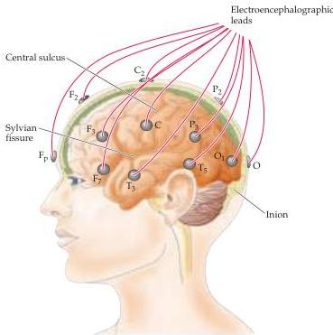

Chapter Twenty-Seven

# Box C

## Electroencephalography

Although electrical activity recorded from the exposed cerebral cortex of a monkey was reported in 1875, it was not until 1929 that Hans Berger, a psychiatrist at the University of Jena, first made scalp recordings of this activity in humans.
Since then, the electroencephalogram, or EEG, has received mixed press, touted by some as a unique opportunity to understand human thinking and denigrated by others as too complex and poorly resolved to allow anything more than a superficial glimpse of what the brain is actually doing.
The truth lies somewhere in between.
Certainly no one disputes that electroencephalography has provided a valuable tool to both researchers and clinicians, particularly in the fields of sleep physiology and epilepsy.

The major advantage of electroencephalography, which involves the application of a set of electrodes to standard positions on the scalp (Figure A), is its great simplicity.
Its most serious limitation is poor spatial resolution, allowing localization of an active site only to within several centimeters.
Four basic EEG phenomena have been defined in humans (albeit somewhat arbitrarily).
The alpha rhythm is typically recorded in awake subjects with their eyes closed.
By definition, the frequency of the alpha rhythm is $8 - 13\mathrm{Hz}$, with an amplitude that is typically $10 - 50\mathrm{mV}$.
Lower-amplitude beta activity is defined by frequencies of $14 - 60\mathrm{Hz}$ and is indicative of mental activity and attention.
The theta and delta waves, which are characterized by frequencies of $4 - 7\mathrm{Hz}$ and less than $4\mathrm{Hz}$, respectively, imply drowsiness, sleep, or one of a variety of pathological conditions; these slow waves in normal individuals are the signature of stage IV

(A) The electroencephalogram represents the voltage recorded between two electrodes applied to the scalp.
Typically, pairs of electrodes are placed in 19 standard positions distributed over the head.
Letters indicate position (F = frontal, P = parietal, T = temporal, O = occipital, C = central).
The recording obtained from each pair of electrodes is somewhat different because each samples the activity of a population of neurons in a different brain region.

non-REM sleep.
The way these phenomena are generated is indicated in Figures B and C.

Far and away the most obvious component of these various oscillations is the alpha rhythm.
Its prominence in the occipital region—and its modulation by eye opening and closing—implies that it is somehow linked to visual processing, as was first pointed out in 1935 by the British physiologist E.
D.
Adrian.
In fact,

evidence from very large numbers of subjects suggests that at least several different regions of the brain have their own characteristic rhythms; for example, within the alpha band (8-13 Hz), one rhythm, the classic alpha rhythm, is associated with visual cortex, one (the mu rhythm) with the sensory motor cortex around the central sulcus, and yet another (the kappa rhythm) with the auditory cortex.