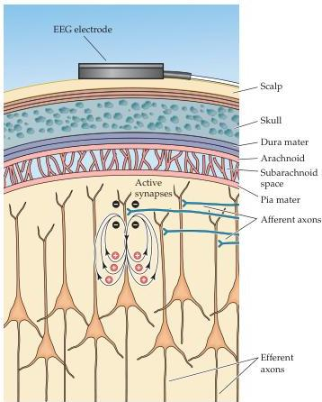

Sleep and Wakefulness 669

(B) An electrode on the scalp measures the activity of a very large number of neurons in the underlying regions of the brain, each of which generates a small electrical field that changes over time.
This activity (which is thought to be mostly synaptic) makes the more superficial extracellular space negative with respect to deeper cortical regions.
The EEG electrode measures a synchronous signal because many thousands of cells are responding in the same manner at more or less the same time.
(Adapted from Bear et al., 2001.)

In the 1940s, Edward W.
Dempsey and Robert Morrison showed that these EEG rhythms depend in part on activity in the thalamus, since thalamic lesions can reduce or abolish the oscillatory cortical discharge (although some oscillatory activity remains even after the thalamus has been inactivated).
At about the same time, H.
W.
Magoun and G.
Moruzzi showed that the reticular activating system in the brainstem is also important in modulating EEG activity.
For example, activation of the reticular formation changes the cortical alpha rhythm to beta activity, in association with greater behavioral alertness.
In the 1960s, Per Andersen and his colleagues in Sweden further advanced these studies by showing that virtually all areas of the cortex participate in these oscillatory rhythms, which reflect a feedback loop between neurons in the thalamus and cortex (see text).

The cortical origin of EEG activity has been clarified by animal studies, which have shown that the source of the current that causes the fluctuating scalp potential is primarily the pyramidal neurons and their synaptic connections in the deeper layers of the cortex (Figures B and C).
(This conclusion was reached by noting the location of electrical field reversal upon passing an electrode vertically through the cortex from surface to white matter.) In general, oscillations come about either because membrane voltage of thalamocortical cells fluctuates spontaneously, or as a result of the reciprocal interaction of excitatory and inhibitory neurons in circuit loops.
The oscillations of the EEG are thought to arise from the latter mechanism.

Despite these intriguing observations, the functional significance of these cortical rhythms is not known.
The purpose of the brain's remarkable oscillatory activity is a puzzle that has defied electroencephalographers and neurobiologists for more than 60 years.

Continued on next page