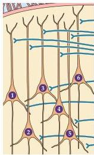
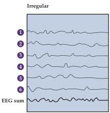
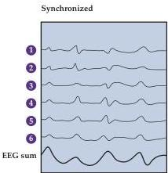

Chapter Twenty-Seven

# Box C

## Electroencephalography (continued)

(C) Generation of the synchronous activity that characterizes deep sleep.
In the pyramidal cell layer below the EEG electrode, each neuron receives thousands of synaptic inputs.
If the inputs are irregular or out of phase, their algebraic sum will have a small amplitude, as occurs in the waking state.
If, on the other hand, the neurons at activated at approximately the same time, then the EEG waves will be in phase and the amplitude will be much greater, as occurs in the delta waves that characterize stage IV sleep.
(Adapted from Bear et al., 2001.)

## References

ADRIAN, E.
D.
AND K.
YAMAGIWA (1935) The origin of the Berger rhythm.
Brain 58: 323-351.
ANDERSEN, P.
AND S.
A.
ANDERSSON (1968) Physiological Basis of the Alpha Rhythm.
New York: Appleton-Century-Crofts.
CATON, R.
(1875) The electrical currents of the brain.
Brit.
Med.
J.
2: 278.
DA SILVA, F.
H.
AND W.
S.
VAN LEEUWEN (1977) The cortical source of the alpha rhythm.
Neurosci.
Letters 6: 237-241.

DEMPSEY, E.
W.
AND R.
S.
MORRISON (1943) The electrical activity of a thalamocortical relay system.
Amer.
J.
Physiol.
138: 283-296.
NIEDERMEYER, E.
AND F.
L.
DA SILVA (1993) Electroencephalography: Basic Principles, Clinical Applications, and Related Fields.
Baltimore: Williams &amp; Wilkins.
NUNEZ, P.
L.
(1981) Electric Fields of the Brain: The Neurophysics of EEG.
New York: Oxford University Press.

again in the second round of this continuing cycling, but generally not during the rest of the night (see Figure 27.7).
On average, four additional periods of REM sleep occur, each having a longer duration.

In summary, the typical 8 hours of sleep experienced each night actually comprise several cycles that alternate between non-REM and REM sleep, and the brain is quite active during much of this supposedly dormant, restful time.
The amount of daily REM sleep decreases from about 8 hours at birth to 2 hours at 20 years to only about 45 minutes at 70 years of age (see Figure 27.1B).
The reasons for this change over the human lifespan are not known.