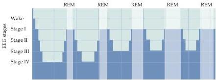
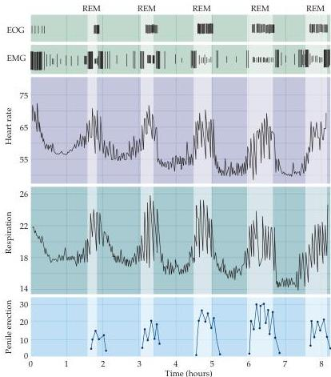

Chapter Twenty-Seven

(A)

(B)
Figure 27.7 Physiological changes in a volunteer during the various sleep states in a typical 8-hour sleep period.
(A) The duration of REM sleep increases from 10 minutes in the first cycle to up to 50 minutes in the final cycle; note that slow-wave (stage IV) sleep is attained only in the first two cycles.
(B) The upper panels show the electro-oculogram (EOG) and the lower panels show changes in various muscular and autonomic functions.
Movement of neck muscles was measured using an electromyogram (EMG).
Other than the few slow eye movements approaching stage I sleep, all other eye movements evident in the EOG occur in REM sleep.
The greatest EMG activity occurs during the onset of sleep and just prior to awakening.
The heart rate (beats per minute) and respiration (breaths per minute) slow in non-REM sleep, but increase almost to the waking levels in REM sleep.
Finally, penile erection (strain gauge units) occurs only during REM sleep.
(After Foulkes and Schmidt, 1983.)