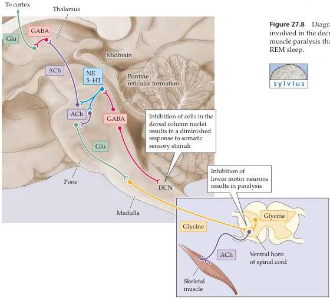

Sleep and Wakefulness 673

tion-laden.
Thus dreaming can also occur during light non-REM sleep, near the onset of sleep and before awakening.

Dreams have been studied in a variety of ways, perhaps most notably within the psychoanalytic framework aimed at revealing unconscious thought processes considered to be at the root of neuroses.
Sigmund Freud's *The Interpretation of Dreams*, published in 1900, speaks eloquently to the complex relationship between conscious and unconscious mentation.
Specifically, Freud thought that during dreaming the “ego” relaxes its hold on the “id,” or subconscious.
For the most part, these ideas are now out of fashion, but to give Freud his due, at the time he made these speculations little was known about neurobiology of the brain in general and sleep in particular.

Since Freud’s time, several other explanations of dreams have been proposed.
One idea is that dreaming releases behaviors less commonly entertained in the waking state (e.g., frank aggression).
Studies have found that about 60% of dream content is associated with sadness, apprehension, or anger; 20% with happiness or excitement; and (somewhat surprisingly) only 10% with sexual feelings or acts.
Another suggestion is that dreaming evolved to dispose of unwanted memories that accumulate during the day.
A further plausible idea about the function of dreams is that they help consolidate learned tasks, perhaps by strengthening synaptic activity associated