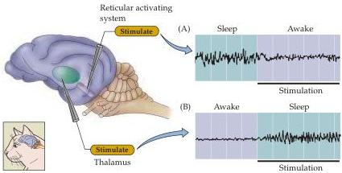

Chapter Twenty-Seven

with recent experiences.
This hypothesis is supported by studies of remembered spatial location in rodents, and by experiments in humans that show a sleep-dependent improvement in learning.
However, some experts, such as Allan Hobson, take the more skeptical view that dream content may be "as much dross as gold, as much cognitive trash as treasure, as much informational noise as a signal of something." Nevertheless, most people, including most sleep researchers, at least privately give some credence to the significance of dream content.

Adding to this uncertainty about the purposes of REM sleep and dreaming is the fact that depriving human subjects of REM sleep for as much as two weeks has little or no obvious effect on their behavior.
The apparent innocuousness of REM sleep deprivation contrasts markedly with the devastating effects of total sleep deprivation mentioned earlier.
The implication of these findings is that we can get along without REM sleep but need non-REM sleep in order to survive.
In summary, the questions of why we have REM sleep and why we dream basically remain unanswered.

## Neural Circuits Governing Sleep

From the descriptions of the various physiological states that occur during sleep, it is clear that periodic charges in the balance of excitation and inhibition must occur in many neural circuits.
What follows is a brief overview of these incompletely understood circuits and the interactions among them that govern sleeping and wakefulness.

In 1949, Horace Magoun and Giuseppe Moruzzi provided one of the first clues about the circuits involved in the sleep-wake cycle.
They found that electrically stimulating a group of cholinergic neurons near the junction of the pons and midbrain causes a state of wakefulness and arousal.
This region of the brainstem was given the name reticular activating system (Figure 27.9A; see also Box A in Chapter 16).
Their work implied that wakefulness requires special activating circuitry—that is, wakefulness is not just the presence of adequate sensory experience.
About the same time, the Swiss physiologist Walter Hess found that stimulating the thalamus in an awake cat with low-frequency pulses produced a slow-wave sleep (Figure 27.9B).
These seminal experiments showed that sleep entails a patterned interaction between the thalamus and cortex.

The saccade-like eye movements that define REM sleep arise because, in the absence of external visual stimuli, endogenously generated signals from

Figure 27.9 Activation of specific neural circuits triggers sleep and wakefulness.
(A) Electrical stimulation of the cholinergic neurons near the junction of pons and midbrain (the reticular activating system) causes a sleeping cat to awaken.
(B) Slow electrical stimulation of the thalamus causes an awake cat to fall asleep.
Graphs show EEG recordings before and during stimulation.