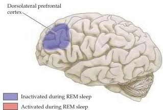
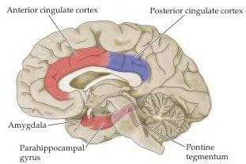

Chapter Twenty-Seven

Figure 27.10 Diagram showing cortical regions whose activity is increased or decreased during REM sleep.
(After Hobson et al., 1989.)

sylvius

the pontine reticular formation are transmitted to the motor region of the superior colliculus.
As described in Chapter 19, collicular neurons project to the paramedialpontine reticular formation (PPRF) and the rostral interstitial nucleus, which coordinates timing and direction of eye movements.
REM sleep is also characterized by EEG waves that originate in the pontine reticular formation and propagate through the lateral geniculate nucleus of the thalamus to the occipital cortex.
These pontine-geniculo-occipital (PGO) waves provide a useful marker for the beginning of REM sleep; they also indicate yet another neural network by which brainstem nuclei can activate the cortex.

Human fMRI and PET (see Box A in Chapter 1) studies have been used to compare brain activity in the awake state and in REM sleep, as well as the phenomenon of consciousness more generally (Box D).
Activity in the amygdala, parahippocampus, pontine tegmentum, and anterior cingulate cortex all increase in REM sleep, whereas activity in the dorsolateral prefrontal and posterior cingulate cortices decreases (Figure 27.10).
The increase in limbic system activity, coupled with a marked decrease in the influence of the frontal cortex during REM sleep, presumably explains some characteristics of dreams (e.g., their emotionality and their often inappropriate social content; see Chapter 25 for the normal role of the frontal cortex in determining behavior that is appropriate to circumstances in the waking state).

Figure 27.11 Important nuclei in regulation of the sleep-wake cycle.
(A) A variety of brainstem nuclei using several different neurotransmitters determines mental status on a continuum that ranges from deep sleep to a high level of alertness.
These nuclei include: (left) the cholinergic nuclei of the pons-midbrain junction and the raphe nuclei; and (right) the locus coeruleus and the tuberomammillary nuclues.
All have widespread ascending and descending connections to other regions (arrows), which explains their numerous effects.
Curved arrows along the perimeter of the cortex indicate the innervation of lateral cortical regions not shown in this plane of section.
(B) Location of hypothalamic nuclei involved in sleep.
(C) Activation of VLPO induces sleep.
Orexin-containing neurons project to different nuclei and produce arousal.