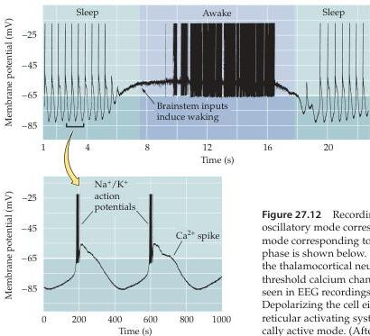

Sleep and Wakefulness 679

With so many systems and transmitters involved in the different phases of sleep, it is not surprising that a wide variety of drugs can influence the sleep cycle (Box E).

## Thalamocortical Interactions

The effects of brainstem nuclei on mental status are achieved by modulating the rhythmicity of interactions between the thalamus and the cortex.
Thus, the activity of several ascending systems from the brainstem decreases both the rhythmic bursting of the thalamocortical neurons and the related synchronized activity of cortical neurons (hence the diminution and ultimate disappearance of high-voltage, low-frequency slow waves during waking and REM sleep; see Box C).

To appreciate how different sleep states reflect modulation of thalamocortical activity, it is useful to consider the electrophysiological responses of the relevant neurons.
Thalamocortical neurons receive ascending projections from the locus coeruleus (noradregeneric), raphe nuclei (serotonin), reticular activating system (acetylcholine), TMN (histamine) and, as their name implies, project to cortical pyramidal cells.
The primary characteristic of thalamocortical neurons is that they can be in one of two stable electrophysiological states (Figure 27.12): an intrinsic oscillatory or bursting state, and a tonically active or firing state that is generated when the neurons are depolarized as occurs when the reticular activating system generates wakefulness; (see Figure 27.11).
In the tonic firing state, thalamocortical neurons transmit information to the cortex that is correlated with the spike trains encoding peripheral stimuli.
In contrast, when thalamocortical neurons are in the oscillatory/bursting mode, the neurons in the thalamus become synchro-

Figure 27.12 Recordings from a thalamocortical neuron, showing the oscillatory mode corresponding to a sleep state, and the tonically active mode corresponding to an awake state.
An expanded view of oscillatory phase is shown below.
Bursts of action potentials are evoked only when the thalamocortical neuron is hyperpolarized sufficiently to activate low-threshold calcium channels.
These bursts account for the spindle activity seen in EEG recordings in stage II sleep (see Figure 27.6 and 27.13).
Depolarizing the cell either by injecting current or by stimulating the reticular activating system transforms this oscillatory activity into a tonically active mode.
(After McCormick and Pape, 1990.)