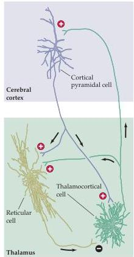
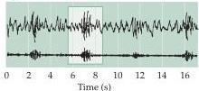
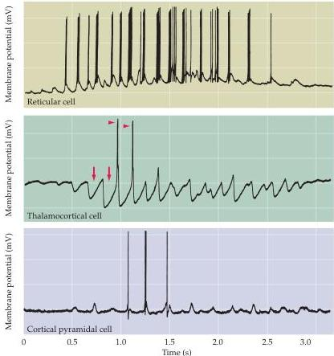

Chapter Twenty-Seven

(A)

(B)

(C)
Figure 27.13 Thalamocortical feedback loop and the generation of sleep spindles.
(A) Diagram showing excitatory (+) and inhibitory (-) connections between thalamocortical cells, pyramidal cells in the cortex, and thalamic reticular cells, which provide the basis for sleep spindle generation.
Inputs into thalamocortical and thalamic reticular cells are not shown.
(B) EEG recordings illustrating sleep spindles (the bottom trace is filtered to accentuate the spindles).
(C) The responses from individual thalamic reticular cells, thalamocortical cells, and cortical cells during the generation of the middle spindle (boxed in panel B).
The bursting behavior of the thalamocortical neurons elicits spikes in cortical cells, which is then evident as spindles in EEG recordings.
(After Steriade et al., 1993.)

nized with those in the cortex, essentially "disconnecting" the cortex from the outside world.
During slow-wave sleep, when EEG recordings show the lowest frequency and the highest amplitude, this disconnection is maximal.

The oscillatory state of thalamocortical neurons can be transformed into the tonically active state by activity in the cholinergic or monoaminergic projections from the brainstem nuclei (Figure 27.13).
Moreover, the oscillatory state is stabilized by hyperpolarizing the relevant thalamic cells.
Such hyperpolarization can occur as a consequence of stimulation by GABAergic neurons in the thalamic reticular nucleus.
These neurons receive ascending