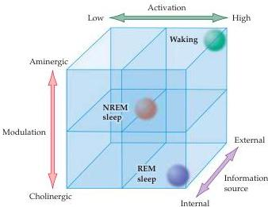

Sleep and Wakefulness 681

Figure 27.14 Summary scheme of sleep-wake states.
In the waking state, activation is high, modulation is aminergic, and the information source is external.
In REM sleep, activation is also high, the modulation is cholinergic, and the information source is internal.
The other states can likewise be remembered in terms of this general diagram.
(After Hobson, 1989.)

information from the brainstem and descending projections from cortical neurons, and they contact the thalamocortical neurons.
When neurons in the reticular nucleus undergo a burst of activity, they cause thalamocortical neurons to generate short bursts of action potentials, which in turn generate spindle activity in cortical EEG recordings (indicating a lighter sleep state; see Figures 27.5 and 27.13).

In brief, the control of sleep and wakefulness depends on brainstem and hypothalamic modulation of the thalamus and cortex.
It is this thalamocortical loop that generates the EEG signature of mental function along the continuum of deep sleep to high alert.
The major components of the brainstem modulatory system are the cholinergic nuclei of the pons–midbrain junction; the noradrenergic cells of the locus coeruleus in the pons; the serotonergic raphe nuclei; and GABAergic neurons in the VLPO.
All of these nuclei can exert both direct and indirect effects on the overall cortical activity that determines sleep and wakefulness.
The relationship among the various sleep–wake states is summarized in the scheme shown in Figure 27.14.

## Sleep Disorders

As noted earlier, an estimated 40% of the U.S.
population experiences some kind of sleep disorder during their lifetime.
Sleep problems occur more frequently with advancing age and are more prevalent in women than in men.
These problems range from simply annoying to life-threatening.
The most prevalent problems are insomnia, sleep apnea, “restless legs” syndrome, and narcolepsy.

Insomnia is the inability to sleep for a sufficient length of time (or deeply enough) to produce refreshment.
This all-too-common problem has many