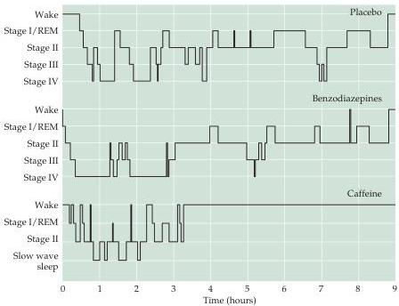

Chapter Twenty-Seven

# Box E

## Drugs and Sleep

It is not surprising that many drugs may affect sleep patterns; the reason is that many neurotransmitters (e.g., acetylcholine, serotonin, norepinephrine, and histamine) are involved in regulating the various states of sleep (see Table 27.1).
A simple but useful way of looking at these effects is that in the waking state, the aminergic system is especially active (see Figure 27.14).
During non-REM sleep, aminergic and cholinergic input both decrease, but aminergic activity decreases more, such that cholinergic inputs become dominant.
Thus there are two major ways drugs alter the sleep pattern: by changing the relative activity of the inputs in any of the three states, or by changing when the different sleep states will commence.
For example, insomnia will ensue if, during the waking state, the aminergic input is increased relative to the cholinergic input; in contrast, hypersomnia occurs when there is increased cholinergic activity relative to the aminergic input.

Because of the large number of people who suffer with sleep disorders, numerous drugs are available to treat these problems.
One class of commonly used drugs is the benzodiapines.
As shown in the figure, these drugs increase the time to onset of the deeper stages of sleep.

Compared to a placebo, benzodiazepines hasten the onset and depth of sleep, whereas caffeine has the opposite effect.

Stimulant drugs that prevent sleep are also commonly used, especially caffeine, which is an adenosine receptor antagonist (adenosine induces sleep).

causes.
Short-term insomnia can arise from stress, jet lag, or simply drinking too much coffee.
A frequent cause is altered circadian rhythms associated with working night shifts.
These problems can usually be prevented by improving sleep habits, avoiding stimulants like caffeine at night, and in some cases taking sleep-promoting medications.
More serious insomnia is associated with psychiatric disorders such as depression (see Chapter 28) that presumably affect the balance between the cholinergic, adrenergic, and serotonergic systems that control the onset and duration of the sleep cycles.
Long-term insomnia is a particular problem in the elderly, both because aged individuals are subject to more depression and because they frequently take medications that can affect the relevant neurotransmitter systems.

Sleep apnea refers to a pattern of interrupted breathing during sleep that affects about 18 million Americans, most often obese, middle aged males.
A person suffering from sleep apnea may wake up dozens or even hundreds of times during the night, with the result that they experience little or no slow-wave sleep and spend less time in REM sleep (Figure 27.15).
These individu