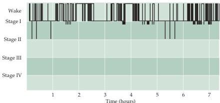

Sleep and Wakefulness 683

als are continually tired and often suffer from depression that exacerbates the problem.
In some high-risk individuals, sleep apnea may even lead to death from respiratory arrest.
The underlying problem is that the airway in susceptible individuals collapses during breathing, thus blocking airflow.
In normal sleep, breathing slows and muscle tone decreases throughout the body, including the tone of the pharynx.
If the output of the brainstem circuitry regulating commands to the chest wall or to pharyngeal muscles is decreased sufficiently, or if the airway is compressed because of obesity, the pharynx tends to collapse as the muscles relax during the normal cycle of breathing.
As a result, oxygen levels decrease and $\mathrm{CO}_{2}$ levels rise.
The rise in $\mathrm{CO}_{2}$ reflexively causes inspiration, which tends to shift the individual from Stage I sleep to the waking state.

A third sleep disorder is restless legs syndrome, a problem that affects about 12 million (mostly elderly) Americans.
The characteristic of this syndrome is unpleasant crawling, prickling, or tingling sensations in one or both legs and feet, and an urge to move them about to obtain relief.
These sensations occur when the person lies down or sits for prolonged periods of time.
The result is constant leg movement during the day and fragmented sleep at night.
The neurobiology of this problem is not understood.
In mild cases, a hot bath, massaging the legs, or eliminating caffeine may alleviate the problem.
In more severe cases, medications such as benzodiazepines may help.

The best-understood sleep disorder is narcolepsy, a chronic disorder that affects about 250,000 people (mostly men) in the United States.
It is the second leading cause of daytime drowsiness, ranking just behind sleep apnea.
Individuals with narcolepsy have frequent "REM sleep attacks" during the day, in which they enter REM sleep from wakefulness without going through non-REM sleep.
These "sleep attacks" can last from 30 seconds to 30 minutes or more.
The onset of sleep in such individuals can be so abrupt that they fall down, with potentially disastrous consequences; this phenomenon is called cataplexy, referring to a temporary loss of muscle control.
Insights into the causes of narcolepsy have come from studies of dogs suffer

Figure 27.15 Sleep apnea.
The sleep pattern of a patient with obstructive sleep apnea.
In this condition, patients awake frequently and never descend into stages III or IV sleep.
The brief descents below stage I in the record represent short periods of REM sleep.
(After Carskadon and Dement, 1989, based on data from G.
Nino-Murcia.)