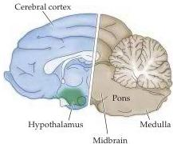
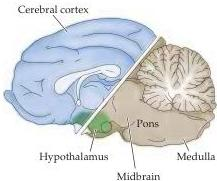

Emotions 689

visceral and somatic motor components of emotional behavior (see Box A in Chapter 20).
Bard removed both cerebral hemispheres (including the cortex, underlying white matter, and basal ganglia) in a series of cats.
When the anesthesia had worn off, the animals behaved as if they were enraged.
The angry behavior occurred spontaneously and included the usual autonomic correlates of this emotion: increased blood pressure and heart rate, retraction of the nictitating membranes (the thin connective tissue sheets associated with feline eyelids), dilation of the pupils, and erection of the hairs on the back and tail.
The cats also exhibited somatic motor components of anger, such as arching the back, extending the claws, lashing the tail, and snarling.
This behavior was called sham rage because it had no obvious target.
Bard showed that a complete response occurred as long as the caudal hypothalamus was intact (Figure 28.1).
Sham rage could not be elicited, however, when the brain was transected at the junction of the hypothalamus and midbrain (although some uncoordinated components of the response were still apparent).
Bard suggested that whereas the subjective experience of emotion might depend on an intact cerebral cortex, the expression of coordinated emotional behaviors does not necessarily entail cortical processes.
He also emphasized that emotional behaviors are often directed toward self-preservation (a point made by Charles Darwin in his classic book on the evolution of emotion), and that the functional importance of emotions in all mammals is consistent with the involvement of phylogenetically older parts of the nervous system.

Complementary results were reported by Walter Hess, who showed that electrical stimulation of discrete sites in the hypothalamus of awake, freely moving cats could also lead to a rage response, and even to subsequent attack behavior.
Moreover, stimulation of other sites in the hypothalamus caused a defensive posture that resembled fear.
In 1949, a share of the Nobel Prize in Physiology or Medicine was awarded to Hess "for his discovery of the functional organization of the interbrain [hypothalamus] as a coordinator of the activities of the internal organs." Experiments like those of Bard and Hess led to the important conclusion that the basic circuits for organized behaviors accompanied by emotion are in the diencephalon and the brainstem structures connected to it.
Furthermore, their work emphasized that the control of the involuntary motor system is not entirely separable from the control of the voluntary pathways, an important consideration in understanding the motor aspects of emotion, as discussed below.

The routes by which the hypothalamus and other forebrain structures influence the visceral and somatic motor systems are complex.
The major targets of the hypothalamus lie in the reticular formation, the tangled web of nerve cells and fibers in the core of the brainstem (see Box A in Chapter 16).
This structure contains over 100 identifiable cell groups, including some of the nuclei that control the brain states associated with sleep and wakefulness described in the previous chapter.
Other important circuits in the reticular formation control cardiovascular function, respiration, urination, vomiting, and swallowing.
The reticular neurons receive hypothalamic input from and feed into both somatic and autonomic effector systems in the brainstem and spinal cord.
Their activity can therefore produce widespread visceral motor and somatic motor responses, often overriding reflex function and sometimes involving almost every organ in the body (as implied by Cannon's dictum about the sympathetic preparation of the animal for fight or flight).

In addition to the hypothalamus, other sources of descending projections from the forebrain to the brainstem reticular formation contribute to the

(A) No "sham rage"

(B) "Sham rage" remains
Figure 28.1 Midsagittal view of a cat's brain, illustrating the regions sufficient for the expression of emotional behavior.
(A) Transection through the midbrain, disconnecting the hypothalamus and brainstem, abolishes "sham rage." (B) The integrated emotional responses associated with "sham rage" survive removal of the cerebral hemispheres as long as the caudal hypothalamus remains intact.
(After LeDoux, 1987.)