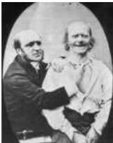
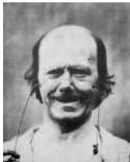
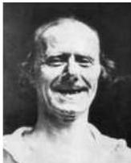
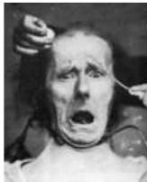

Chapter Twenty-Eight

# Box A

## Facial Expressions: Pyramidal and Extrapyramidal Contributions

In 1862, the French neurologist and physiologist G.-B.
Duchenne de Boulogne published a remarkable treatise on facial expressions.
His work was the first to systematically examine the contributions of small groups of cranial muscles to the expressions that communicate the richness of human emotion.
Duchenne reasoned that "one would be able, like nature herself, to paint the expressive lines of the emotions of the soul on the face of man." In so doing, he sought to understand how the coordinated contractions of groups of muscles express distinct, pan-cultural emotional states.
To achieve this goal, he pioneered the use of transcutaneous electrical stimulation (then called "faradization" after the British chemist and physicist Michael Faraday) to activate single muscles and small groups of muscles in the face, dorsal surface of the head, and neck.
Duchenne also documented the faces of his subjects with another technological innovation: photography (Figure A).
His seminal contribution was the identification of muscles and muscle groups, such as the obicularis oculi, that cannot be activated by force of the will, but are only "put into play by the sweet emotions of the soul." Duchenne concluded that the emotion-driven contraction of these muscle groups surrounding the eyes, together with the zygomaticus major, convey the genuine experience of happiness, joy and laughter.
In recognition of these insights, psychologists sometimes refer to this facial expression as the "Duchenne smile."

In normal individuals, such as the Parisian shoemaker illustrated in Figure A, the difference between a forced smile (produced by voluntary contraction or electrical stimulation of facial muscles) and a spontaneous (emotional) smile testifies to the convergence of descending motor signals from different forebrain centers onto premotor and motor neurons in the brainstem that control the facial musculature.
In contrast to the Duchenne smile, the contrived smile of volition (sometimes called a "pyramidal smile") is driven by the motor cortex, which communicates with the brainstem and spinal cord via the pyramidal tracts.
The Duchenne smile is motivated by accessory motor areas in the prefrontal cortex (see Box B in Chapter 16) and ventral parts of the basal ganglia that access brainstem nuclei via multisynaptic, "extrapyramidal" pathways through the brainstem reticular formation.

Studies of patients with specific neurological injury to these separate descending systems of control have further differentiated the forebrain centers responsible for control of the muscles of facial expression (Figure B).
Patients with unilateral facial paralysis due to damage of descending pathways from the motor cortex (upper motor neuron syndrome; see Chapter 16) have considerable difficulty moving their lower facial muscles on one side, either voluntarily or in response to commands, a condition called voluntary facial paresis (Figure B, left panels).
Nonetheless, many such

(A) Duchenne and one of his subjects undergoing "faradization" of the muscles of facial expression (1).
Bilateral electrical stimulation of the zygomaticus major mimicked a genuine expression of happiness (2), although closer examination shows insufficient contraction of the obicularis oculi (surrounding the eyes) compared to spontaneous laughter (3).
Stimulation of the brow and neck produced an expression of "terror mixed with pain, torture ...
that of the damned" (4); however, the subject reported no discomfort or emotional experience consistent with the evoked contractions.

(A)

(1)

(2)

(3)
(4)