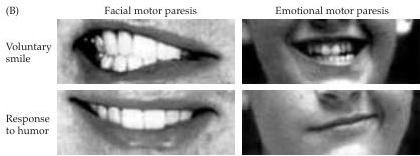

Emotions 691

(B) Left panels: Mouth of a patient with a lesion that destroyed descending fibers from the right motor cortex displaying voluntary facial paresis.
When asked to show her teeth, the patient was unable to contract the muscles on the left side of her mouth (upper left), yet her spontaneous smile in response to a humorous remark is nearly symmetrical (lower left).
Right panels: Face of a child with a lesion of the left forebrain that interrupted descending pathways from nonclassical motor cortical areas, producing emotional facial paresis.
When asked to smile volitionally, the contractions of the facial muscles are nearly symmetrical (upper right).
In spontaneous response to a humorous comment, however, the right side of the patient's face fails to express emotion (lower right).

(C) The complementary deficits demonstrated in Figure B are explained by selective lesions of one of two anatomically and functionally distinct sets of descending projections that motivate the muscles of facial expression.

individuals produce symmetrical involuntary facial movements when they laugh, frown, or cry in response to amusing or distressing stimuli.
In such patients, pathways from regions of the forebrain other than the classical motor cortex in the posterior frontal lobe remain available to activate facial movements in response to stimuli with emotional significance.

A much less common form of neurological injury, called emotional facial paresis, demonstrates the opposite set of impairments, i.e., loss of the ability to express emotions by using the muscles of the face without loss of volitional control (Figure B, right panels).
Such individuals are able to produce symmetrical pyramidal smiles, but fail to display spontaneous emotional expressions involving the facial musculature contralateral to the lesion.
These two systems are diagrammed in Figure C.

# References

DUCHENNE DE BOULOGNE, G.-B.
(1862) Mécanisme de la Physionomie Humaine.
Paris: Editions de la Maison des Sciences de l'Homme.
Edited and translated by R.
A.
Cuthbertson (1990).
Cambridge: Cambridge University Press.

HOPE, H.
C., W.
MÜLLER-FORELL AND N.
J.
HOPE (1992) Localization of emotional and volitional facial paresis.
Neurol.
42:1918-1923.

TROSCH, R.
M., G.
SZE, L.
M.
BRASS AND S.
G.
WAXMAN (1990) Emotional facial paresis with striatocapsular infarction.
J.
Neurol.
Sci.
98:195-201.

WAXMAN, S.
G.
(1996) Clinical observations on the emotional motor system.
In Progress in Brain Research, Vol.
107.
G.
Holstege, R.
Bandler and C.
B.
Saper (eds.).
Amsterdam: Elsevier, pp.
595-604.