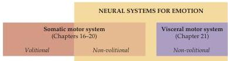
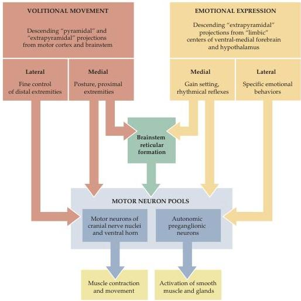

Chapter Twenty-Eight

(A)

(B)

expression of emotional behavior.
Collectively, these additional centers in the forebrain are considered part of the limbic system, which is described in the following section.
These descending influences on the expression of somatic and visceral motor behavior arise outside of the classic motor cortical areas in the posterior frontal lobe.