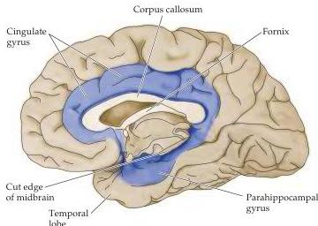

Chapter Twenty-Eight

Figure 28.3 The so-called limbic lobe includes the cortex on the medial aspect of the cerebral hemisphere that forms a rim around the corpus callosum and diencephalon, including the cingulate gyrus (lying above the corpus callosum) and the parahippocampal gyrus.
Historically, the olfactory bulb and olfactory cortex (not illustrated here) have also been considered to be important elements of the limbic lobe.

the medial aspects of the cerebral hemisphere.
In the 1850s, Paul Broca used the term "limbic lobe" to refer to the part of the cerebral cortex that forms a rim (limbus is Latin for rim) around the corpus callosum and diencephalon on the medial face of the hemispheres (Figure 28.3).
Two prominent components of this region are the cingulate gyrus, which lies above the corpus callosum, and the parahippocampal gyrus, which lies in the medial temporal lobe.

For many years, these structures, along with the olfactory bulbs, were thought to be concerned primarily with the sense of smell.
Indeed, Broca considered the olfactory bulbs to be the principal source of input to the limbic lobe.
Papez, however, speculated that the function of the limbic lobe might be more related to emotions.
He knew from the work of Bard and Hess that the hypothalamus influences the expression of emotion; he also knew, as everyone does, that emotions reach consciousness, and that higher cognitive functions affect emotional behavior.
Ultimately, Papez showed that the cingulate cortex and hypothalamus are interconnected via projections from the mammillary bodies (part of the posterior hypothalamus) to the anterior nucleus of the dorsal thalamus, which projects in turn to the cingulate gyrus.
The cingulate gyrus (and many other cortical regions as well) projects to the hippocampus.
Finally, he showed that the hippocampus projects via the fornix (a large fiber bundle) back to the hypothalamus.
Papez suggested that these pathways provided the connections necessary for cortical control of emotional expression, and they became known as the "Papez circuit."

Over time, the concept of a forebrain circuit for the control of emotional expression, first elaborated by Papez, has been revised to include parts of the orbital and medial prefrontal cortex, ventral parts of the basal ganglia, the mediodorsal nucleus of the thalamus (a different thalamic nucleus than the one emphasized by Papez), and a large nuclear mass in the temporal lobe anterior to the hippocampus, called the amygdala.
This set of structures, together with the parahippocampal gyrus and cingulate cortex, is generally referred to as the limbic system (Figure 28.4).
Thus, some of the structures that Papez originally described (the hippocampus, for example) now appear to have little to do with emotional behavior, whereas the amygdala, which was hardly mentioned by Papez, clearly plays a major role in the experience and expression of emotion (Box B).