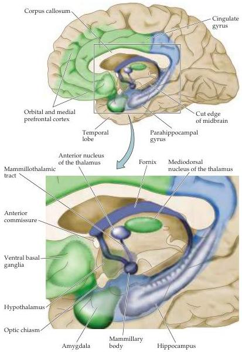

Emotions

Figure 28.4 Modern conception of the limbic system.
Two especially important components of the limbic system not emphasized in early anatomical accounts are the orbital and medial prefrontal cortex and the amygdala.
These two telencephalic regions, together with related structures in the thalamus, hypothalamus and ventral striatum, are especially important in the experience and expression of emotion (colored green).
Other parts of the limbic system, including the hippocampus and the mammillary bodies of the hypothalamus, are no longer considered important neural centers for processing emotion (colored blue).

About the same time that Papez proposed that these structures were important for the integration of emotional behavior, Heinrich Klüver and Paul Bucy were carrying out a series of experiments on rhesus monkeys in which they removed a large part of both medial temporal lobes, thus destroying much of the limbic system.
They reported a set of abnormal behaviors in these animals that is now known as the Klüver-Bucy syndrome (Box C).
Among the most prominent changes was visual agnosia: the animals appeared to be unable to recognize objects, although they were not blind, a deficit similar to that sometimes seen in human patients following lesions of the temporal cortex (see Chapter 25).
In addition, the monkeys displayed bizarre oral behaviors.
For instance, these animals would put objects into their mouths that normal monkeys would not.
They exhibited hyperactivity and hypersexuality, approaching and making physical contact with

sylvius