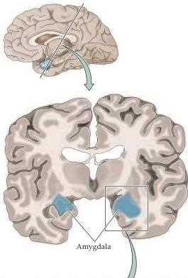
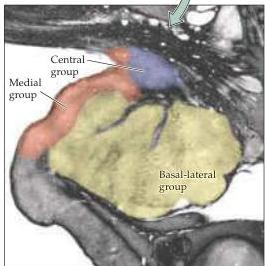

Chapter Twenty-Eight

# Box B

## The Anatomy of the Amygdala

The amygdala is a complex mass of gray matter buried in the anterior-medial portion of the temporal lobe, just rostral to the hippocampus (Figure A).
It comprises multiple, distinct subnuclei and cortical regions that are richly connected to other nearby cortical areas on the ventral and medial aspect of the hemispheric surface.
The amygdala (or amygdaloid complex, as it is often called) can best be thought of in terms of three major functional and anatomical subdivisions, each of which has a unique set of connections with other parts of the brain (Figures B and C).
The medial group of subnuclei has extensive connections with the olfactory bulb and the olfactory cortex.
The basal-lateral group, which is especially large in humans, has major connections with the cerebral cortex, especially the orbital and medial prefrontal cortex of the frontal lobe and the associational cortex of the anterior temporal lobe.
The central and anterior group of nuclei is characterized by connections with the hypothalamus and brainstem, including such visceral sensory structures as the nucleus of the solitary tract and the parabrachial nucleus.

The amygdala thus links cortical regions that process sensory information with hypothalamic and brainstem effector systems.
Cortical inputs provide information about highly processed visual, somatic sensory, visceral sensory, and auditory stimuli.
These pathways from sensory cortical areas distinguish the amygdala from the hypothalamus, which receives relatively unprocessed visceral sensory inputs.
The amygdala also receives sensory input directly from some thalamic nuclei, the olfactory bulb, and visceral sensory relays in the brainstem.

Physiological studies have confirmed this convergence of sensory information.
Thus, many neurons in the amygdala respond to visual, auditory, somatic

(A)

(A) Coronal section through the forebrain at the level of the amygdala; box indicates the region illustrated in panel (B).
(B) Histological section through the human amygdala, stained with silver salts to reveal the presence of myelinated fiber bundles.
These bundles subdivide major nuclei and cortical regions within the amygdaloid complex.
(Courtesy of Joel Price.)

(A) Coronal section through the forebrain at the level of the amygdala; box indicates the region illustrated in panel (B).
(B) Histological section through the human amygdala, stained with silver salts to reveal the presence of myelinated fiber bundles.
These bundles subdivide major nuclei and cortical regions within the amygdaloid complex.