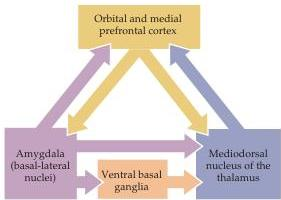

Emotions 697

(C)

(C) The amygdala (specifically, the basal-lateral group of nuclei) participates in a "triangular" circuit linking the amygdala, the thalamic mediodorsal nucleus (directly and indirectly via the ventral parts of the basal ganglia), and the orbital and medial prefrontal cortex.
These complex interconnections allow direct interactions between the amygdala and prefrontal cortex, as well as indirect modulation via the circuitry of the ventral basal ganglia.

sensory, visceral sensory, gustatory, and olfactory stimuli.
Moreover, highly complex stimuli are often required to evoke a neuronal response.
For example, there are neurons in the basal-lateral group of nuclei that respond selectively to the sight of faces, very much like the "face" neurons in the inferior temporal cortex (see Chapter 25).

In addition to sensory inputs, the prefrontal and temporal cortical connections of the amygdala give it access to more overtly cognitive neocortical circuits, which integrate the emotional significance of sensory stimuli and guide complex behavior.

Finally, projections from the amygdala to the hypothalamus and brainstem

(and possibly as far as the spinal cord) allow it to play an important role in the expression of emotional behavior by influencing activity in both the somatic and visceral motor efferent systems.

## Reference

PRICE, J.
L., F.
T.
RUSSCHEN AND D.
G.
AMARAL (1987) The limbic region II: The amygdaloid complex.
In Handbook of Chemical Neuroanatomy, Vol.
5, Integrated Systems of the CNS, Part I, Hypothalamus, Hippocampus, Amygdala, Retina.
A.
Björklund and T.
Hökfelt (eds.).
Amsterdam: Elsevier, pp.
279–388.

virtually anything in their environment; most importantly, they showed marked changes in emotional behavior.
Because they had been caught in the wild, the monkeys had typically reacted with hostility and fear to humans before their surgery.
Postoperatively, however, they were virtually tame.
Motor and vocal reactions generally associated with anger or fear were no longer elicited by the approach of humans, and the animals showed little or no excitement when the experimenters handled them.
Nor did they show fear when presented with a snake—a strongly aversive stimulus for a normal rhesus monkey.
Klüver and Bucy concluded that this remarkable change in behavior was at least partly due to the interruption of the pathways described by Papez.
A similar syndrome has been described in humans who have suffered bilateral damage of the temporal lobes.

When it was later demonstrated that the emotional disturbances of the Klüver–Bucy syndrome could be elicited by removal of the amygdala alone, attention turned more specifically to the role of this structure in the control of emotional behavior.

## The Importance of the Amygdala

Experiments first performed in the late 1950s by John Downer at University College London vividly demonstrated the importance of the amygdala in aggressive behavior.
Downer removed one amygdala in rhesus monkeys, at