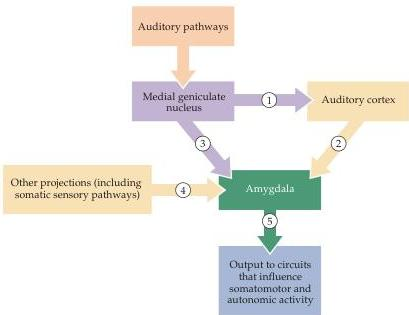

Emotions 699

To better understand the role of the amygdala in evaluating stimuli, and to define more precisely the specific circuits and mechanisms involved, several other animal models of emotional behavior have since been developed.
One of the most useful is based on conditioned fear responses in rats.
Conditioned fear develops when an initially neutral stimulus is repeatedly paired with an inherently aversive one.
Over time, the animal begins to respond to the neutral stimulus with behaviors similar to those elicited by the threatening stimulus (i.e., it learns to attach a new meaning to the neutral stimulus).
Studies of the parts of the brain involved in the development of conditioned fear in rats have begun to shed some light on this process.
Joseph LeDoux and his colleagues at New York University trained rats to associate a tone with a mildly aversive foot shock delivered shortly after onset of the sound.
To assess the animals' responses, they measured blood pressure and the length of time the animals crouched without moving (a fearful reaction called "freezing").
Before training, the rats did not react to the tone, nor did their blood pressure change when the tone was presented.
After training, however, the onset of the tone caused a marked increase in blood pressure and prolonged periods of behavioral freezing.
Using this paradigm, LeDoux and his colleagues worked out the neural circuitry that established the association between the tone and fear (Figure 28.5).
First, they demonstrated that the medial geniculate nucleus is necessary for the development of the conditioned fear response.
This result is not surprising, since all auditory information that reaches the forebrain travels through the medial geniculate nucleus of the dorsal thalamus (see Chapter 12).
They went on to show, however, that the responses were still elicited if the connections between the medial geniculate and auditory cortex were severed, leaving only a direct projection between the medial geniculate and the basal-lateral group of nuclei in the amygdala.
Furthermore, if the part of the medial geniculate that projects to the amygdala was also destroyed, the fear

Figure 28.5 Pathways in the rat brain that mediate the association of auditory and aversive somatic sensory stimuli.
Information processed by the auditory centers in the brainstem is relayed to the auditory cortex via the medial geniculate nucleus (1).
The amygdala receives auditory information indirectly via the auditory cortex (2) and directly from one subdivision of the medial geniculate (3).
The amygdala also receives sensory information about other sensory modalities, including pain (4).
Thus, the amygdala is in a position to associate diverse sensory inputs, leading to new behavioral and autonomic responses to stimuli that were previously devoid of emotional content (5).