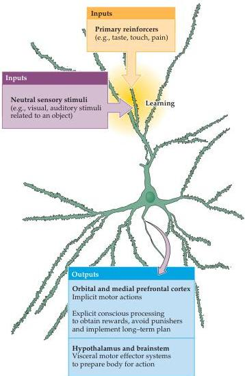

Chapter Twenty-Eight

responses were abolished.
Subsequent work in LeDoux's laboratory established that projections from the central group of nuclei in the amygdala to the midbrain reticular formation are critical in the expression of freezing behavior, while other projections from this group to the hypothalamus control the rise in blood pressure.

Since the amygdala is a site where neural activity produced by both tones and shocks can be processed, it is reasonable to suppose that the amygdala is also the site where learning about fearful stimuli occurs.
These results, among others, have led to the broader hypothesis that the amygdala participates in establishing associations between neutral sensory stimuli, such as a mild auditory tone or the sight of inanimate object in the environment, and other stimuli that have some primary reinforcement value (Figure 28.6).
The neutral sensory input can be stimuli in the external environment, stimuli

Figure 28.6 Model of associative learning in the amygdala relevant to emotional function.
Most neutral sensory inputs are relayed to principal neurons in the amygdala by projections from "higher order" sensory processing areas that represent objects (e.g., faces).
If these sensory inputs depolarize amygdalar neurons at the same time as inputs that represent other sensations with primary reinforcing value, then associative learning occurs by strengthening synaptic linkages between the previously neutral inputs and the neurons of the amygdala (see Chapter 24 for synaptic mechanisms of learning).
The output of the amygdala then informs a variety of integrative centers responsible for the somatic and visceral motor expression of emotion, and for modifying behavior relevant to seeking rewards and avoiding punishment.
(After Rolls, 1999.)