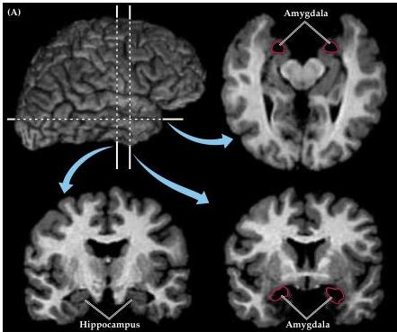
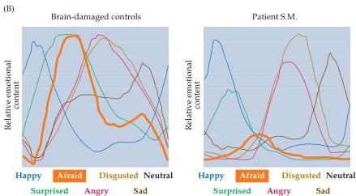

Chapter Twenty-Eight

# Box D

## Fear and the Human Amygdala: A Case Study

Studies of fear conditioning in rodents show that the amygdala plays a critical role in the association of an innocuous auditory tone with an aversive mechanical sensation.
Does this finding imply that the human amygdala is similarly involved in the experience of fear and the expression of fearful behavior? Recent reports of at least one extraordinary patient support the idea that the amygdala is indeed a key brain center for the experience of fear.

The patient (S.M.) suffers from a rare, autosomal recessive condition called Urbach-Wiethe disease, a disorder that causes bilateral calcification and atrophy of the anterior-medial temporal lobes.
As a result, both of S.M.'s amygdalas are extensively damaged, with little or no detectable injury to the hippocampal formation or nearby temporal neocortex (Figure A).
She has no motor or sensory impairment, and no notable deficits in intelligence, memory, or language function.
However, when asked to rate the intensity of emotion in a series of photographs of facial expressions, she cannot recognize the emotion of fear (Figure B).
Indeed, S.M.'s ratings of emotional content in fearful facial expressions were several standard deviations below the ratings of control patients who had suffered brain damage outside of the anterior-medial temporal lobe.

The investigators next asked S.M.
(and the brain-damaged control subjects) to draw facial expressions of the same set of emotions from memory.
Although the subjects obviously differed in artistic abilities and the detail of their renderings, S.M.
(who has some artistic experience) produced skillful pictures of each emotion, except for fear (Figure C).
At first, she could not produce a sketch of a fearful expression and, when prodded to do so, explained that "she did not know what an afraid

(A) MRI showing the extent of brain damage in patient S.M; note the bilateral destruction of the amygdala and the preservation of the hippocampus.
(B) Patients with brain damage outside of the anterior-medial temporal lobe and patient S.M.
rated the emotional content of a series of facial expressions.
Each colored line represents the intensity of the emotions judged in the face.
S.M.
recognized happiness, surprise, anger, disgust, sadness, and neutral qualities in facial expressions about as well as controls.
However, she failed to recognize fear (orange lines).
(A courtesy of R.
Adolphs.)

