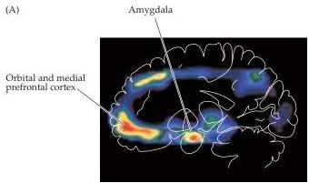
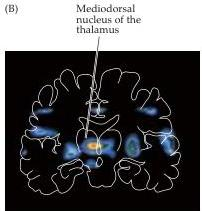

Chapter Twenty-Eight

# Box E

## Affective Disorders

Although some degree of disordered emotion is present in virtually all psychiatric problems, in affective (mood) disorders the essence of the disease is an abnormal regulation of the feelings of sadness and happiness.
The most severe of these afflictions are major depression and manic depression.
(Manic depression is also called "bipolar disorder," since such patients experience alternating episodes of depression and euphoria.) Depression, the most common of the major psychiatric disorders, has a lifetime incidence of 10–25% in women and 5–12% in men.
For clinical purposes, depression (as distinct from bereavement or neurotic unhappiness) is defined by a set of standard criteria.
In addition to an abnormal sense of sadness, despair, and bleak feelings about the future (depression itself), these criteria include disordered eating and weight control, disordered sleeping (insomnia or hypersomnia), poor concentration, inappropriate guilt, and diminished sexual interest.
The personally overwhelming quality of major depression has been compellingly described by patient/authors such as William Styron, and by afflicted psychologists such as Kay Jamison.
The depressed patient's profound sense of despair has been nowhere better expressed than by Abraham Lincoln, who during a period of depression wrote:

I am now the most miserable man living.
If what I feel were equally distributed to the whole human family, there would not be one cheerful face on earth.
Whether I shall ever be better, I cannot tell; I awfully forebode I shall not.
To remain as I am is impossible.
I must die or be better, it appears to me.

Indeed, about half the suicides in this country occur in individuals with clinical depression.

Not many decades ago, depression and mania were considered disorders that arose from circumstances or a neurotic inability to cope.
It is now universally accepted that these conditions are neurobiological disorders.
Among the strongest lines of evidence for this consensus are studies of the inheritance of these diseases.
For example, the concordance of affective disorders is high in monozygotic compared to dizygotic twins.
It has also become possible to study the brain activity of patients suffering from affective disorders by noninvasive brain imaging (see Figure).
In at least one condition, unipolar depression, abnormal patterns of blood flow are apparent in the "triangular" circuit interconnecting the amygdala, the mediodorsal nucleus of the thalamus, and the orbital and medial prefrontal cortex (see Box B).
Of particular interest is the significant correlation of abnormal blood flow in the amygdala and the clinical severity of depression, as well as the observation that the abnormal blood flow pattern in the prefrontal cortex returns to normal when the depression has abated.

Despite evidence for a genetic predisposition and an increasing understanding of the brain areas involved, the cause of these conditions remains unknown.
The efficacy of a large number of drugs

Areas of increased blood flow in the left amygdala, orbital, and medial prefrontal cortex (A) and in a location in the left medial thalamus consistent with the mediodorsal nucleus (B) from a sample of patients diagnosed with unipolar clinical depression.
The "hot" colors indicate statistically significant increases in blood flow, compared to a sample of nondepressed subjects.
(From Drevets and Raichle, 1994.)

L R